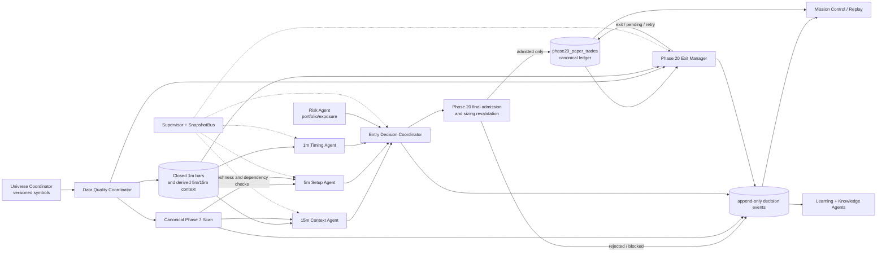

# ApexQuant AI: Multi-Agent Intraday Architecture Proposal

**Status:** Architecture only  
**Date:** 21 August 2026  
**Scope:** Paper-only NSE intraday analysis, simulated paper entries and exits, auditability, and operational visibility.

## 1. Executive summary

ApexQuant already contains most of the durable building blocks needed for a coordinated intraday system:

- A canonical Phase 7 market scan and scan-state store.
- An existing multi-agent framework, registry, health model, and `SnapshotBus`.
- Advisory Market Intelligence, Stock Monitoring, Strategy, Risk, AI Decision, Learning, Knowledge, Execution Planning, and Supervisor agents.
- A single canonical Phase 20 paper-trade ledger and simulated execution authority.
- A robust scheduled exit path with EOD recovery, `EXIT_PENDING`, and audit events.
- Mission Control, pipeline events, replay, and portfolio projections for operator visibility.

The principal architectural gap is **not another trading bot**. It is a durable, close-of-bar intraday evidence layer that lets existing agents reason consistently across 15-minute context, 5-minute setup, and 1-minute timing without creating a second position book, second execution path, or mutable trade history.

The proposed design coordinates existing agents through immutable/versioned snapshots and `SnapshotBus` topics. Every candidate still passes one final risk/admission gate and the sole paper-ledger writer. No agent gains authority to place a broker order, write a trade directly, tune thresholds autonomously, or mutate a completed historical trade.

> **This document is a proposal only. No implementation, database migration, threshold change, workflow change, environment change, or trading-logic change was made while preparing it.**

## 2. Confirmed current safety baseline

The following existing controls are architectural constraints, not future options:

1. **Paper only.** Phase 20 creates simulated paper orders and fills; it is not a live-broker order executor.
2. **One ledger writer.** `phase20_executor.py` is the canonical writer for `phase20_paper_trades`. Advisory agents do not write trades.
3. **One open paper position per symbol.** Admission and ledger constraints prevent a duplicate open position.
4. **Market-state failure closes entry permission.** New entries are denied if reliable market-state evidence is unavailable.
5. **No automatic entries after 15:15 IST.** `market_hours.automatic_paper_entry_status()` and Phase 20 execution checks enforce the no-new-entry window.
6. **Close safety is distinct from entry safety.** The existing exit flow continues to monitor positions after entry cutoff; market-close exit handling begins at 15:20 IST and post-close force-close recovery applies after 15:30 IST.
7. **No fabricated exits.** When dependable pricing is unavailable, the current exit flow records `EXIT_PENDING` rather than inventing a fill.
8. **Completed trades are historical evidence.** New intraday observations and audits must append facts; they must not rewrite entry, exit, quantity, or P&L history.
9. **Agent work is advisory.** Existing framework agents publish snapshots and recommendations. The Supervisor observes health and never auto-restarts or trades.
10. **Broker access remains read-only/simulated.** No live order API is enabled, invoked, or proposed as part of this architecture.

## 3. Current code-flow map

### 3.1 Present operational path

```text
Configured universe / watchlist
  └─> live_data_provider.py
        ├─> ohlcv_cache_store.py (daily OHLCV cache)
        ├─> optional kite_ltp_overlay.py (point-in-time LTP only)
        └─> live_scan_engine.py
              ├─> data-quality, price, volume and eligibility gates
              ├─> recommendations + provenance
              ├─> scan_state_store.py (canonical scan snapshot/history)
              └─> pipeline_events.py (append-only pipeline evidence)

Phase 20 scheduler
  ├─> pre_market_data_readiness.py / post_market_data_refresh.py
  ├─> canonical live scan
  ├─> phase20_exits.manage_open_positions()
  ├─> phase20_executor.run_auto_entries() when separately enabled and eligible
  └─> EOD outcome/retry/force-close paths

phase20_executor.py
  ├─> paper-entry admission and simulated fill model
  ├─> phase20_paper_trades (canonical paper ledger)
  ├─> paper_trader / portfolio projection support
  └─> pipeline events and durable execution outcomes

canonical_portfolio.py / replay_engine.py
  └─> canonical positions, cash, equity, realized P&L, trade history,
      pipeline reconstruction, and operational views

API routes
  └─> Mission Control + AI Paper Trader dashboard surfaces
```

### 3.2 Existing agent-framework path

```text
Canonical scan / portfolio / research evidence
  └─> SnapshotBus topics
        ├─> Market Data Agent
        ├─> Market Intelligence Agent
        ├─> Stock Monitoring Agent
        ├─> Strategy Agent
        ├─> Risk Agent
        ├─> AI Decision Agent
        ├─> Execution Agent (planning/validation only)
        ├─> Learning Agent
        └─> Knowledge Agent

AgentRegistry + Supervisor Agent
  └─> lifecycle, dependencies, heartbeat, topic freshness, and alerts

Important boundary:
  Agent snapshots may inform a Phase 20 candidate.
  Only Phase 20 admission/execution may create or close a paper-ledger trade.
```

### 3.3 Important current limitations

1. The API-server’s canonical scan is fundamentally daily-OHLCV analysis with optional current LTP overlay.
2. The configured Phase 20 scan cadence is not proof of a corresponding 5-minute candle feed.
3. There is no confirmed durable, canonical 1-minute/5-minute/15-minute candle store used by the API-server agents.
4. There is no dedicated durable high-water/low-water or per-evaluation price-tracking model for every open paper trade.
5. Existing Phase 20 exits are the operational exit authority, while stock monitoring remains advisory. That separation must remain explicit.
6. A separate `intraday-trading-bot` codebase contains concepts such as completed bars, timeframe aggregation, VWAP, repositories, and paper-broker abstractions. It must **not** be wired in as a parallel ledger or execution system. Its reusable interfaces can be evaluated later behind ApexQuant’s canonical boundaries.

## 4. Existing modules and agent-equivalent responsibilities

| Role / equivalent | Current implementation | Present responsibility | Required authority boundary |
|---|---|---|---|
| Universe | Watchlist/config readers and scan inputs | Select active symbols for scans | Can define candidate scope; cannot decide execution |
| Market data | `live_data_provider.py`, `ohlcv_cache_store.py`, `kite_ltp_overlay.py` | Daily bars, cache health, optional LTP overlay | Raw facts only; no recommendation or trade write |
| Canonical scan | `live_scan_engine.py`, `scan_state_store.py` | One scan ID/timestamp, quality gates, recommendations, scan snapshot | Owns canonical scan provenance, not the ledger |
| Pre/post market data operations | `pre_market_data_readiness.py`, `post_market_data_refresh.py` | Readiness checks and daily cache refresh | No intraday execution decisions |
| Scheduler | `phase20_scheduler.py`, `phase20_store.py` | Leased market jobs, scans, exit jobs, automatic-entry orchestration, EOD recovery | Schedules work; must not bypass gates |
| Market-data agent | `agent_framework/market_data_agent/` | Publish data availability, watchlist and scan context | Advisory snapshot publisher |
| Market-intelligence agent | `agent_framework/market_intelligence_agent/` | Regime, breadth, sector, volatility and session context | Advisory snapshot publisher |
| Stock-monitoring agent | `agent_framework/stock_monitoring_agent/` | Symbol priority and monitoring state | Advisory monitoring; does not exit positions |
| Strategy agent | `agent_framework/strategy_agent/` | Evaluate/select strategy candidates and rationale | Candidate evidence only |
| Risk agent | `agent_framework/risk_agent/` | Exposure, sizing, sector/correlation, portfolio heat and drawdown views | Advises; final ledger admission stays elsewhere |
| AI decision agent | `agent_framework/ai_decision_agent/` | Explainable candidate aggregation/ranking | Advisory; no order placement |
| Execution agent | `agent_framework/execution_agent/` | Paper execution planning and pre-execution validation display | Never becomes a second executor |
| Final entry authority | `phase20_executor.py`, `paper_entry_admission.py` | Final paper-entry admission, duplicate prevention, fill simulation, canonical ledger write | Sole writer for paper entries |
| Exit manager | `phase20_exits.py` + Phase 20 executor exit recording | Stop, target, recommendation, trailing, time, stale-data, risk, EOD and pending-exit handling | Sole operational close path |
| Portfolio authority | `canonical_portfolio.py` | Ledger-derived positions, cash, equity, realized P&L and trade history | Must read only Phase 20 canonical ledger |
| Audit/event system | `pipeline_events.py`, `replay_engine.py` | Append-only pipeline evidence and reconstruction | Evidence is not a substitute ledger |
| Learning/knowledge | `learning_agent/`, `knowledge_agent/` | Post-session patterns, outcomes, memory and operator insights | Advisory; no autonomous tuning |
| Supervision | `supervisor_agent/`, `AgentRegistry`, `SnapshotBus` | Freshness, dependency, lifecycle and health alerts | Observes and alerts; never trades/restarts automatically |
| Operator UI | Mission Control, AI Paper Trader, agent configuration | Shows portfolio, pipeline, alerts, agents and paper trades | Displays facts and operator controls only |

## 5. Proposed coordinated multi-agent architecture

### 5.1 Design principles

1. **Enrich the existing system; do not fork it.** Retain Phase 7 scans, Phase 10 agents, Phase 20 execution/exits, Phase 23 replay, portfolio projections, and Mission Control.
2. **Facts before opinions.** Every agent consumes closed-bar data, canonical scans, or ledger state and emits a versioned snapshot with provenance.
3. **No direct agent-to-agent calls.** Use the existing `SnapshotBus` and durable reference IDs. Consumers reject stale, missing, mismatched-session, or mismatched-universe inputs.
4. **One entry transaction and one exit transaction boundary.** Final trade creation and closing remain inside Phase 20.
5. **Separate timeframes by responsibility.** 15-minute establishes context, 5-minute identifies setup, and 1-minute refines timing. A lower timeframe cannot overturn a failed higher-timeframe safety gate.
6. **Close bars, not provisional ticks.** Strategy and decision evidence should use completed normalized bars. Current LTP may support fill/exit price reliability but must be labeled as a point quote.
7. **Every decision is reconstructable.** A decision must reference a scan/session, bar-close timestamp(s), upstream snapshot IDs, strategy version, risk version, and active configuration hash.
8. **Fail closed for entry; degrade safely for exits.** Missing/stale critical data blocks a new entry. An exit lacking reliable price remains `EXIT_PENDING` with explicit evidence and retry/recovery behavior.

### 5.2 Target roles

| Target role | Coordination responsibility | Existing assets to use | Proposed state |
|---|---|---|---|
| Universe Coordinator | Produce versioned active-symbol set and membership provenance | Current watchlist/config + scan state | Reuse with a versioned snapshot contract |
| Data Quality Coordinator | Normalize provider facts, data age, session completeness and close-bar validity | Live provider, cache, Kite LTP overlay, readiness checks | Modify existing data boundary; no trade authority |
| 15-minute Context Agent | Regime, market breadth, sector strength, trend, volatility, opening-range/session phase | Market Intelligence Agent + canonical scan | Modify/add an intraday-context adapter |
| 5-minute Setup Agent | Detect eligible setup structure, VWAP/EMA/ORB/pullback/consolidation evidence | Strategy Agent + intraday bars | Modify/add strategy-input adapter |
| 1-minute Timing Agent | Confirm timing only after context/setup approval, using completed 1-minute bars | Stock Monitoring Agent + timing adapter | New narrow advisory module |
| Entry Decision Coordinator | Combine eligible evidence, identify conflicts, generate explainable entry candidate | AI Decision Agent | Modify decision contract, not its authority |
| Risk & Sizing Gate | Validate current exposure and calculate/revalidate admissible paper size | Risk Agent + Phase 20 admission | Reuse advisory risk, retain Phase 20 as final gate |
| Paper Ledger Executor | Atomically admit, simulate, record and publish entry | Phase 20 executor and admission lock | Reuse unchanged as final writer |
| Position/Exit Coordinator | Evaluate open positions on every relevant update and schedule EOD safety | Phase 20 exits + Scheduler | Modify with durable price/evaluation evidence |
| EOD Safety Coordinator | Enforce late-session entry cutoff, close/retry/force-close audit outcomes | Market hours, Scheduler, Phase 20 exits | Reuse unchanged safeguards; increase observability only |
| Audit & Learning Coordinator | Persist decision evidence and consume completed-trade outcomes | Pipeline events, replay, Learning, Knowledge | New audit projections plus existing learning consumers |
| Supervisor | Check topic freshness, dependencies, worker health and stop unsafe candidate creation | Supervisor Agent and AgentRegistry | Reuse with new topic contracts |

### 5.3 Information-flow diagram



### 5.4 Numbered information flow

1. The Universe Coordinator emits an immutable active-universe snapshot with a membership version and timestamp.
2. The Data Quality Coordinator requests/receives market facts, validates provider provenance and age, and records only completed bars that are suitable for analysis.
3. The bar service produces 1-minute closed bars and deterministic 5-minute/15-minute aggregates. Aggregates reference their component bars and close timestamps.
4. The 15-minute Context Agent publishes regime, session phase, breadth, sector, volatility, and higher-timeframe invalidation conditions.
5. The 5-minute Setup Agent publishes strategy setup evidence only when its required context is current and valid.
6. The 1-minute Timing Agent publishes a confirmation or rejection only for an already valid setup. It never creates a candidate by itself.
7. The AI Decision Agent/Entry Decision Coordinator combines the three evidence layers, scan evidence, research, and risk snapshot into an explainable candidate or rejection.
8. The Risk Agent provides a contemporaneous advisory exposure/sizing view. Phase 20 independently rechecks capital, entry window, duplicate position, safety gates, and final quantity inside the admission boundary.
9. If admitted, `phase20_executor.py` alone records the simulated entry in `phase20_paper_trades` and emits terminal execution evidence. If denied, a durable reason event/audit record is emitted without creating a trade.
10. The Exit Manager evaluates every open canonical Phase 20 position on relevant closed bars, scan/LTP updates, and scheduled safety ticks. It records an evaluation result even when no exit is taken.
11. Exit decisions flow through the existing Phase 20 close/recording path. A missing reliable fill price becomes `EXIT_PENDING`, followed by the existing retry/EOD recovery process rather than a fabricated exit.
12. Pipeline events, decision/exit audits, and ledger state feed Mission Control, replay, Learning, and Knowledge. None of these downstream consumers mutate the ledger.

## 6. Reuse / modify / new responsibility matrix

| Responsibility | Reuse unchanged | Modify existing implementation | Truly new work | Deferred |
|---|---|---|---|---|
| Universe | Existing watchlist/config selection | Add immutable membership/version provenance | Optional universe-snapshot projection | Historical membership rebuild policy |
| Data | Provider, cache, LTP overlay, readiness checks | Add source-quality and close-bar contract | Durable intraday bar ingestion/normalization | Tick-level/order-book ingestion |
| 15-minute context | Market Intelligence Agent | Consume 15m closed-bar context and publish provenance | Context adapter/contract if needed | Adaptive regime thresholds |
| 5-minute setup | Strategy Agent | Consume 5m closed-bar strategy evidence | Setup adapter/strategy evidence projection | New strategies or parameter optimization |
| 1-minute timing | Stock Monitoring Agent concepts | Link timing only to approved setup | Narrow timing-confirmation agent | Tick microstructure, latency-sensitive execution |
| Entry decision | AI Decision Agent | Add multi-timeframe conflict/provenance contract | Append-only entry-decision audit projection | Autonomous decision tuning |
| Risk/sizing | Risk Agent + Phase 20 admission | Pass through evidence references, revalidate quantity atomically | Optional sizing-evidence projection | Changing risk limits/thresholds |
| Exit manager | `phase20_exits.py`, Scheduler, Phase 20 exit writer | Consume durable price tracking and record every evaluation | Append-only exit-decision audit projection | New exit thresholds/logic changes |
| EOD safety | Market hours and existing Phase 20 EOD paths | Add data-quality and audit visibility only | None required | Altering cutoff/close times |
| Audit/learning | Pipeline events, Replay, Learning, Knowledge | Link completed decisions/exits to immutable evidence | New audit projections/tables | Auto-application of lessons |
| Paper ledger | Phase 20 executor, `phase20_paper_trades`, canonical portfolio | Add immutable foreign-reference fields only if justified | None; never a replacement ledger | Live broker execution |

## 7. Inputs, outputs, events, and tables

| Component | Primary inputs | Output snapshot / event | Persistent authority | Rejection/failure behavior |
|---|---|---|---|---|
| Universe Coordinator | Watchlist/config, session date | `universe_snapshot` | Existing configuration plus future version projection | Empty/invalid universe blocks candidate creation |
| Data Quality Coordinator | Provider bars, cache metadata, LTP availability | `market_data_quality_snapshot`, completed-bar references | Future `intraday_candles`; existing cache remains daily source | Mark stale/unavailable; entry blocked |
| 15m Context | Closed 15m bars, scan, universe, market data quality | `intraday_context_snapshot` | Versioned agent output projection | No fresh context means no setup/entry |
| 5m Setup | Closed 5m bars, context, strategy configuration | `strategy_setup_snapshot` | Versioned strategy-agent output projection | Reject non-confirming or stale setup |
| 1m Timing | Closed 1m bars, approved setup/context | `timing_confirmation_snapshot` | Versioned monitoring/timing output projection | Timing rejection cannot be overridden by a lower-level component |
| Entry Decision | Context, setup, timing, risk, scan/research evidence | `entry_decision` / `ENTRY_DECISION_REJECTED` | `entry_decision_audit` + pipeline events | Missing/conflicting dependency yields explicit no-entry |
| Final Phase 20 admission | Entry decision, current settings, open positions, capital, clock | `ORDER_EXECUTED` / blocked terminal reason | `phase20_paper_trades` | Fail closed; do not create a partial ledger trade |
| Exit Manager | Canonical open positions, price history, current reliable quote, clock | `exit_decision` / `EXIT_PENDING` / closed result | `exit_decision_audit`, Phase 20 ledger | Pending/retry instead of fabricated fill |
| EOD Safety | Open canonical positions, session state, reliable close price/retry state | EOD acknowledgement/retry/force-close evidence | Existing EOD store, events, ledger | Deduped blocked/pending outcome and recovery |
| Learning/Knowledge | Completed ledger trades, audits, pipeline/replay evidence | Insights, patterns, operator-review recommendations | Existing learning/knowledge stores | Advisory only; never change active rules |

## 8. Data-model gap analysis

These are architectural data contracts only. **No table, column, migration, or schema was created in this turn.**

### 8.1 `intraday_candles`

**Purpose:** Store normalized, immutable, closed 1-minute market bars as the base evidence for deterministic 5-minute and 15-minute aggregation.

**Why it is needed:** Current API-server evidence is daily OHLCV plus optional point-in-time LTP. A scheduler running every five minutes does not establish a five-minute candle history. Reliable intraday signals and forensic replay require a close timestamp, provider provenance, and a stable bar identity.

**Recommended logical fields:**

| Field group | Proposed fields |
|---|---|
| Identity | `symbol`, `exchange`, `interval`, `bar_open_ts`, `bar_close_ts`, `source`, `source_bar_id` where available |
| OHLCV facts | `open`, `high`, `low`, `close`, `volume`, `vwap` when provider-supported |
| Quality | `is_closed`, `received_at`, `provider_age_ms`, `quality_status`, `quality_reason`, `ingest_run_id` |
| Lineage | `universe_version`, `session_date_ist`, `raw_payload_hash`, `created_at` |

**Recommended rules:**

- Make bar identity unique on instrument, interval, open/close time, and source/version policy.
- Do not overwrite a closed bar silently. Corrections need an explicit supersession/provenance model.
- Derive 5m/15m bars deterministically from stored 1m closed bars or store them with explicit parent-bar lineage.
- Preserve source and quality metadata so LTP/tick evidence is never confused with a completed candle.
- Do not backfill historical data in a way that pretends it was available during an earlier paper decision.

### 8.2 `paper_trade_price_tracking`

**Purpose:** Capture non-economic observations for an open paper trade: price samples, high-water/low-water, source reliability, and evaluation-time price provenance.

**Why it is needed:** Existing trade records represent the ledger truth. They should not be repeatedly mutated to carry every intraday observation. A separate append-only tracking stream enables trailing/excursion analysis, exit explanations, and data-quality diagnosis without changing completed trade history.

**Recommended logical fields:**

| Field group | Proposed fields |
|---|---|
| Identity | `trade_id`, `observed_at`, `source`, `scan_id`, `bar_ref` |
| Price evidence | `price`, `bid`, `ask`, `ltp`, `high_since_entry`, `low_since_entry`, `mark_price` |
| Reliability | `data_quality`, `age_ms`, `is_tradable_price`, `reason` |
| Position context | `quantity_at_observation`, `entry_price`, `unrealized_pnl`, `drawdown_from_high` |
| Lineage | `session_date_ist`, `event_id`, `created_at` |

**Recommended rules:**

- The price tracking model is append-only and references a canonical Phase 20 `trade_id`.
- It may derive high/low water marks, but it must never rewrite the historical entry/exit transaction.
- A stale/unavailable observation is retained as evidence; it cannot masquerade as a tradable exit price.
- Retention/rollup policy should be designed before deployment to avoid unbounded tick-level storage.

### 8.3 `strategy_agent_outputs`

**Purpose:** Preserve the exact versioned strategy evidence supplied to a downstream decision.

**Recommended logical fields:**

- `output_id`, `agent_run_id`, `strategy_id`, `strategy_version`
- `symbol`, `session_date_ist`, `as_of_ts`, `timeframe`
- `context_snapshot_id`, `setup_snapshot_id`, `timing_snapshot_id`
- `status` (`ELIGIBLE`, `REJECTED`, `INSUFFICIENT_DATA`, `STALE`)
- Structured rationale, gates evaluated, feature/reference IDs, confidence, quality status
- `config_hash`, `created_at`, and optional expiry/freshness metadata

**Recommended rules:**

- Record rejected outputs as well as eligible outputs so selection bias can be audited.
- Store references/hashes to bar data instead of duplicating all raw bars in every output.
- Do not treat an old strategy output as current simply because it has a high score.

### 8.4 `entry_decision_audit`

**Purpose:** Record each final advisory entry decision and the precise reason it was admitted, rejected, or blocked before Phase 20 creates a trade.

**Recommended logical fields:**

- `decision_id`, `correlation_id`, `scan_id`, `symbol`, `session_date_ist`, `decided_at`
- Universe, data-quality, 15m context, 5m setup, 1m timing, strategy, risk, and research snapshot references
- Decision action, candidate quantity, final recommended quantity, confidence, conflict flags
- Explicit gate outcomes and refusal reason codes
- `phase20_trade_id` only after final admission succeeds
- `config_hash`, `model/strategy versions`, `created_at`

**Recommended rules:**

- This audit is not a command queue and cannot cause execution by itself.
- A Phase 20 rejection remains a terminal audit outcome with a reason even if the advisory decision was positive.
- Denied candidates—including after-15:15 candidates—must be recorded as no-entry evidence, never as a partially open order.

### 8.5 `exit_decision_audit`

**Purpose:** Record all materially evaluated exit decisions, including “hold,” `EXIT_PENDING`, retry, forced safety exit, and executed exit.

**Recommended logical fields:**

- `exit_audit_id`, `trade_id`, `evaluated_at`, `trigger_source`, `session_date_ist`
- Current price/bar references, high/low-water reference, data-quality assessment
- Trigger candidates: stop, target, recommendation, trailing, time, portfolio risk, sector cap, stale-data, market-close, post-close force-close
- Decision (`HOLD`, `EXIT_REQUESTED`, `EXIT_PENDING`, `CLOSED`, `RETRY_SCHEDULED`, `BLOCKED`)
- Chosen reason, rejected higher-priority triggers, price/fill provenance, retry linkage
- `phase20_exit_transaction_id` after the ledger records the close

**Recommended rules:**

- “No action” evaluations need a sampling/deduplication policy, but critical changes and every terminal/pending decision must persist.
- The audit cannot substitute for a close transaction or declare a fill independently.
- EOD results should connect to the existing acknowledged close/blocked outcome path.

## 9. Strategy and exit logic mapping

The supplied research describes a multi-timeframe intraday process. The proposal maps it into ApexQuant’s existing authority model without adopting or altering thresholds in this design phase.

| Research theme | Proposed architectural location | Evidence needed | Current system fit |
|---|---|---|---|
| Trend/regime alignment | 15m Context Agent | Closed 15m bars, broader scan/regime/breadth evidence | Extend Market Intelligence context |
| Opening range / session behavior | 15m Context + 5m Setup | Session-time-aware bar windows, completed bars | New intraday evidence contract |
| VWAP alignment | 5m Setup and 1m Timing | Intraday volume and close-bar sequence | Requires durable intraday bars |
| EMA pullback / momentum setup | 5m Setup | Closed 5m bars plus strategy provenance | Extend Strategy Agent inputs |
| Breakout/retest/consolidation | 5m Setup | Level references, volume context, bar close proof | Strategy output/audit projection |
| Entry confirmation | 1m Timing | Closed 1m confirmation bar tied to an approved setup | New advisory timing component |
| Stop/target/trailing/time exits | Phase 20 Exit Manager | Canonical position, price tracking, decision priority | Existing exit authority; improve evidence only |
| Profit protection / high-water tracking | Phase 20 Exit Manager | Append-only tracking observations | Dedicated tracking gap |
| Risk-based position sizing | Risk Agent + Phase 20 admission | Portfolio state, stop/evidence, current capital | Existing dual advisory/final-gate pattern |
| Late-session discipline | Market-hours + Phase 20 Scheduler/Executor | IST market clock and session state | Already enforced; do not modify |
| EOD exit and recovery | Phase 20 exits/scheduler/store | Price reliability, retry state, ledger close acknowledgement | Already implemented; increase observability only |
| Review/learning | Learning and Knowledge Agents | Completed ledger trades plus entry/exit audits | Existing advisory consumers |

### Exit-priority principle

The existing Phase 20 exit authority should remain the authoritative evaluator. A future implementation should define and test one explicit priority ordering for simultaneous triggers, then persist both the selected reason and the competing reasons in `exit_decision_audit`. This prevents an operator from seeing an unexplained exit when a stop, time, trailing, and EOD condition overlap.

No new stop, target, trailing, VWAP, ORB, EMA, sizing, or time threshold is proposed or changed by this document.

## 10. File-by-file future modification plan

This section identifies likely implementation targets for a future approved phase. It is not an instruction to edit them now.

### 10.1 Existing files to reuse with no functional ownership change

| File / area | Preserve |
|---|---|
| `artifacts/api-server/src/python/phase20_executor.py` | Sole entry/ledger authority, atomic admission, duplicate prevention, paper-only simulated fills |
| `artifacts/api-server/src/python/phase20_exits.py` | Sole operational exit manager and pending/retry/EOD behavior |
| `artifacts/api-server/src/python/canonical_portfolio.py` | Canonical portfolio projections exclusively from the Phase 20 ledger |
| `artifacts/api-server/src/python/pipeline_events.py` | Append-only pipeline/evidence event role |
| `artifacts/api-server/src/python/scan_state_store.py` | Canonical scan snapshots/locks/freshness |
| `artifacts/api-server/src/python/agent_framework/snapshot_bus.py` | Topic-based agent communication; no direct calls |
| `artifacts/api-server/src/python/agent_framework/supervisor_agent/supervisor.py` | Health/freshness observer; no auto-restart or trade authority |
| `artifacts/api-server/src/python/market_hours.py` | Existing no-new-entry and close-state safety boundaries |

### 10.2 Existing files likely to be extended

| File / area | Future extension, subject to approval |
|---|---|
| `live_data_provider.py` | Add an explicit intraday provider contract and provenance handling while retaining daily scan behavior |
| `ohlcv_cache_store.py` | Keep daily cache separate; do not overload it silently with intraday semantics |
| `live_scan_engine.py` | Reference multi-timeframe evidence and its freshness in canonical scan recommendations |
| `phase20_scheduler.py` | Schedule close-bar processing and position-evaluation jobs under the existing lease/heartbeat model; retain entry/exit ordering and EOD safeguards |
| `phase20_store.py` | Add only durable coordination/state needed for intraday jobs, with no duplicate trading state |
| `phase20_exits.py` | Consume verified tracking evidence and emit detailed evaluation/audit references without creating a second exit path |
| `market_data_agent/` | Publish intraday data availability and quality snapshots |
| `market_intelligence_agent/` | Publish 15m context snapshot references |
| `stock_monitoring_agent/` | Publish 1m timing/monitoring evidence; continue to be advisory |
| `strategy_agent/` | Publish 5m setup and strategy-output provenance |
| `risk_agent/` | Carry input freshness and evidence references into advisory sizing output |
| `ai_decision_agent/` | Aggregate multi-timeframe decision evidence and conflicts into an auditable candidate |
| `execution_agent/` | Display/validate planned paper execution only; never write a ledger record |
| `learning_agent/` and `knowledge_agent/` | Consume decision and exit audits after trades close; remain advisory |
| `pipeline_events.py` / route adapters | Register event schemas, dedupe identities, replay support, and safe query filters |
| Mission Control and AI Paper Trader frontend surfaces | Display data freshness, timeframe evidence, decision chain, position tracking, exit reason, and pending state without hiding uncertainty |
| `AgentConfig.ts` | Add navigation/labels only once the backend contracts are implemented and verified |

### 10.3 Truly new future modules or projections

Suggested names are illustrative and should be aligned to repository conventions during a future implementation:

| Proposed module / projection | Responsibility |
|---|---|
| `intraday_bar_store.py` | Persist/query normalized, closed 1m bars and deterministic aggregates with provenance |
| `intraday_bar_aggregator.py` | Build 5m/15m completed aggregates from 1m facts |
| `intraday_context.py` | Form 15m context contract used by Market Intelligence |
| `intraday_setup.py` | Form 5m setup-evidence contract used by Strategy |
| `intraday_timing.py` | Narrow 1m confirmation contract, dependent on a valid setup |
| `paper_trade_tracking_store.py` | Append-only per-trade price/high-low evidence |
| `decision_audit_store.py` | Append-only entry and exit audit projections and query helpers |
| `intraday_contracts.py` | Typed event/snapshot schemas, correlation IDs, freshness and provenance rules |

### 10.4 Existing separate intraday-bot project

`intraday-trading-bot/` has independently developed modules for completed bars, timeframe aggregation, market intelligence, paper brokerage, repositories, and broker-related services.

Future work should first compare its pure domain models and tests with ApexQuant requirements. It must not:

- connect its repositories to the canonical ApexQuant ledger without an explicit migration/integration plan;
- become a second scheduler, portfolio authority, or position service;
- write directly to `phase20_paper_trades`;
- enable or call live broker order APIs;
- replace `SnapshotBus`, Phase 20 admission, or Phase 20 exit authority.

Reusable pure calculations may be adapted behind ApexQuant interfaces only after contract tests prove parity and lifecycle ownership.

## 11. Safe phased implementation plan

### Phase A — Contracts, baselines, and observability

1. Freeze and test the current Phase 20 entry cutoff, EOD, canonical-ledger, and no-duplicate-position contracts.
2. Define versioned snapshot/event schemas, correlation IDs, freshness semantics, and explicit failure reasons.
3. Add read-only Mission Control diagnostics for the absence or staleness of intraday evidence.
4. Do not change strategy thresholds, create trades, or require automatic paper entry to be enabled.

**Exit criteria:** Existing operational behavior remains unchanged; operators can distinguish “no intraday evidence exists” from “intraday evidence rejected a candidate.”

### Phase B — Paper-only intraday data foundation

1. Introduce a closed-bar ingestion and storage boundary for 1m facts, quality metadata, and deterministic 5m/15m aggregates.
2. Build historical/replay fixtures without portraying after-the-fact data as contemporaneous evidence.
3. Publish data-quality snapshots through `SnapshotBus`.
4. Keep daily Phase 7 scan behavior available and separate while compatibility is proven.

**Exit criteria:** Deterministic bar reconstruction, no silent duplicate bars, explicit stale/missing-data behavior, and no execution integration yet.

### Phase C — Advisory multi-timeframe agents

1. Extend Market Intelligence with 15m context outputs.
2. Extend Strategy with 5m setup outputs.
3. Add a narrow 1m timing confirmation output that cannot originate a trade candidate.
4. Extend AI Decision aggregation to consume these snapshots and produce explanatory accepts/rejects.
5. Persist audit-only decisions, including rejected decisions.

**Exit criteria:** The system produces advisory candidate/rejection evidence only. Phase 20 automatic entries remain unchanged unless an operator separately enables the already existing controls.

### Phase D — Final-gate integration in paper mode

1. Let the Phase 20 executor consume an approved decision reference as additional evidence.
2. Retain all Phase 20 independent checks: entry window, market state, data quality, risk/capital, duplicate prevention, and atomic ledger write.
3. Ensure a positive advisory decision can still be rejected by final admission with an auditable reason.
4. Verify only the existing executor can create the trade.

**Exit criteria:** No second ledger writer, no duplicate open positions under concurrent jobs, no entry after 15:15 IST, and replay reconciles entries to events/audits.

### Phase E — Position tracking and exit evidence

1. Add append-only price tracking for open Phase 20 trades.
2. Expand Phase 20 exit evaluations to record chosen and competing triggers, no-action samples, pending state, retries, and EOD outcomes.
3. Preserve the existing `EXIT_PENDING` behavior when pricing is unsafe.
4. Surface high-water/low-water and exit provenance in Mission Control and AI Paper Trader.

**Exit criteria:** Every closed or pending position can be traced from entry evidence through price observations and exit decision to ledger outcome.

### Phase F — Learning, review, and guarded rollout

1. Feed completed decisions and exit audits into Learning/Knowledge in read-only advisory mode.
2. Compare candidate quality and exit outcomes against existing baseline behavior during paper shadow/replay operation.
3. Require explicit operator review before adopting any learned recommendation or changing any parameter.
4. Roll out by symbol cohort/session flag with fast disable controls and a no-write fallback.

**Exit criteria:** Improvements are measurable, explainable, reversible, and do not alter historical records.

## 12. Testing plan

### 12.1 Contract and unit tests

- Closed-bar identity, timezone/session boundaries, aggregation determinism, late/corrected-bar policy, and provider provenance.
- Data freshness contracts: stale/unavailable data cannot produce an entry candidate.
- 15m/5m/1m dependency chain: missing, stale, different-symbol, different-session, or mismatched-universe input is rejected.
- Strategy and decision output validation, schema version compatibility, and conflict handling.
- Risk/sizing evidence forwarding without altering current thresholds or final Phase 20 authority.
- Entry audit: every candidate gets an accepted/rejected/blocked terminal state.
- Exit audit: stop/target/trailing/time/EOD overlaps retain selected and competing reasons.
- `EXIT_PENDING` and retry behavior remain explicit and do not fabricate a fill.

### 12.2 Integration and concurrency tests

- Scheduler lease/heartbeat behavior for new close-bar jobs.
- One canonical `scan_id`/session correlation chain through context, setup, timing, decision, admission, and audit.
- Two simultaneous admission attempts for one symbol result in at most one open Phase 20 ledger trade.
- Entry rejection at and after 15:15 IST, including startup/retry paths.
- Close safety at 15:20 IST and post-close force-exit/retry path after 15:30 IST.
- Position tracking is append-only and does not mutate completed ledger transactions.
- Replay/reconciliation: event/audit references agree with `phase20_paper_trades` and canonical portfolio state.

### 12.3 Data-quality and replay tests

- Provider outage, stale LTP, stale bars, partial universe coverage, clock skew, duplicate bars, out-of-order bars, and timezone changes.
- Historical simulation does not use later universe membership, later bar corrections, or later data quality facts.
- LTP point quotes cannot be represented as a completed 1m candle.
- Data-quality degradation produces a visible reason and blocks entry, while exit safety follows pending/retry rules.

### 12.4 UI and operational tests

- Mission Control shows freshness for each new topic and distinguishes unavailable, stale, rejected, pending, and executed conditions.
- AI Paper Trader displays canonical quantity/position state and linked entry/exit audit evidence.
- Browser tests verify errors are surfaced rather than silently rendering an empty/healthy state.
- Supervisor tests verify stale dependencies create health alerts but never create a trade or restart an agent.

## 13. Risk, rollback, and operational controls

| Risk | Mitigation | Rollback / safe response |
|---|---|---|
| Dual execution or duplicate portfolio authority | Preserve Phase 20 as the only ledger writer; keep agents advisory | Disable new coordinator consumers; retain existing Phase 20 path |
| Intraday data gaps create unsafe decisions | Closed-bar/data-quality gate and fail-closed entry behavior | Mark intraday layer unavailable; revert to existing daily-scan behavior with no new multi-timeframe entry |
| Exit logic fabricates a fill during outage | Keep existing `EXIT_PENDING`, retry and EOD recovery semantics | Stop new exit-rule consumers; run existing recovery/audit path |
| Scheduler overlap creates duplicate work | Reuse existing leases, idempotency, correlation IDs and admission lock | Disable new scheduled jobs; rely on existing scheduler duties |
| Stale agent output is accepted | Topic freshness, session/universe/bar reference validation | Reject stale decision; create a no-entry audit event |
| Audit growth or query slowness | Sampling/retention/rollup design before broad rollout | Disable verbose evaluation recording while retaining critical terminal events |
| Historical evidence is mutated | Append-only observations/audits separate from ledger transaction data | Stop writer and reconstruct views from immutable ledger/events |
| Reuse of separate intraday-bot creates conflicting state | Treat it as source/reference only; adapt pure interfaces behind contracts | Do not connect its repos/services to ApexQuant production paths |
| Automatic adaptation changes active policy | Keep Learning/Knowledge advisory and operator-reviewed | Disable advisory consumer; no active settings were changed |
| Accidental broker activation | Maintain paper-only final executor and forbid broker order calls | Remove/disable any future live adapter integration; ledger remains paper-only |

### Rollback boundary

Each future phase should ship behind its own feature flag and with a “no new writes” fallback. The rollback goal is to remove the new intraday consumer/producer path while leaving the canonical Phase 7 scan, Phase 20 paper ledger, Phase 20 exit manager, portfolio projection, and historical evidence intact. No rollback should delete or rewrite completed paper trades.

## 14. Decisions deferred deliberately

The following require separate product, data-provider, and safety approval. They are not decided or implemented here:

- Intraday market-data provider choice, entitlement, quotas, retention, and correction policy.
- Exact candle intervals beyond the proposed 1m fact / 5m setup / 15m context separation.
- Specific VWAP, ORB, EMA, momentum, stop, target, trailing, time-stop, confidence, or sizing thresholds.
- Which strategies are enabled for which regime.
- Whether any advisory decision should ever be eligible for automatic paper entry.
- Operator override design and audit policy.
- Historical backfill extent and data licensing.
- Learning model design, acceptance criteria, and whether learned guidance affects an operator workflow.
- Any live broker execution capability.

## 15. Explicit completion confirmation

- **No application code was implemented or modified.**
- **No database tables, columns, migrations, thresholds, environment variables, workflows, or trading settings were changed.**
- **No paper or live broker order was placed, enabled, or called.**
- **No live-order capability is proposed by this document.**
- **The only artifact created for this request is this architecture proposal file.**