# INTRADAY_BUSINESS_LOGIC_MAP.md

> **Scope** — End-to-end business-logic documentation for the NSE intraday paper-trading / research system.  
> **Method** — All claims are sourced from direct code reading; unknown or runtime-unverified facts are marked **[UNKNOWN]** or **[UNVERIFIED-RUNTIME]**.  
> **Governance** — This document is read-only; it describes but does not propose fixes.  
> **Legacy / Canonical coexistence** — Flagged with ⚠️ **LEGACY** or ⚠️ **DUAL-PATH** where applicable.

---

## Table of Contents

1. [System Topology](#1-system-topology)  
2. [End-to-End Flow Diagram](#2-end-to-end-flow-diagram)  
3. [Scheduler & Event Stream Flow](#3-scheduler--event-stream-flow)  
4. [Market Ingestion](#4-market-ingestion)  
5. [Pre-Open Intelligence](#5-pre-open-intelligence)  
6. [Universe Selection](#6-universe-selection)  
7. [Multi-Timeframe Scan Pipeline](#7-multi-timeframe-scan-pipeline)  
8. [Signals / Strategy / Risk / Approval](#8-signals--strategy--risk--approval)  
9. [Paper Execution Lifecycle](#9-paper-execution-lifecycle)  
10. [Positions / Exits](#10-positions--exits)  
11. [Portfolio / P&L / Risk](#11-portfolio--pl--risk)  
12. [Alerts & System Health](#12-alerts--system-health)  
13. [Replay & Research](#13-replay--research)  
14. [Analytics & AI](#14-analytics--ai)  
15. [Dashboard Refresh (Frontend-to-Backend)](#15-dashboard-refresh-frontend-to-backend)  
16. [External Systems](#16-external-systems)  
17. [Diagram: Pre-Open Session](#17-diagram-pre-open-session)  
18. [Diagram: Trading Session](#18-diagram-trading-session)  
19. [Diagram: Paper-Order Lifecycle](#19-diagram-paper-order-lifecycle)  
20. [Diagram: Portfolio / Risk Loop](#20-diagram-portfolio--risk-loop)  
21. [Diagram: Replay & Research](#21-diagram-replay--research)  

---

## 1. System Topology

There are **two distinct codebases** that coexist:

| Codebase | Root | Runtime | Purpose |
|---|---|---|---|
| **API Server** (primary) | `artifacts/api-server/` | Node.js (Express) + Python subprocess | Research / paper-trading platform serving the dashboard |
| **Intraday Trading Bot** (secondary, isolated) | `intraday-trading-bot/` | Python FastAPI | Potential live-broker layer; connected via `RECON_PUBLISH_TOKEN` over HTTP |
| **Dashboard** | `artifacts/trading-dashboard/` | React (Vite) SPA | Operator UI |

⚠️ **DUAL-PATH**: These two codebases share no process boundary at runtime — the intraday-trading-bot publishes reconciliation summaries to the API server via `POST /api/broker/reconciliation/publish` (token-gated). All scanning, paper trading, portfolio management, signals and analytics run exclusively in the **API Server** codebase. The intraday-trading-bot's live-broker capability is present but activation requires all five `ZERODHA_*` env gates plus `TRADING__MODE != PAPER`. Whether the bot is deployed alongside the API server in production is **[UNVERIFIED-RUNTIME]**.

---

## 2. End-to-End Flow Diagram

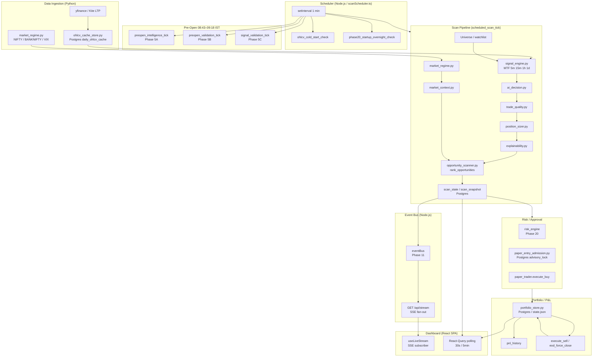

---

## 3. Scheduler & Event Stream Flow

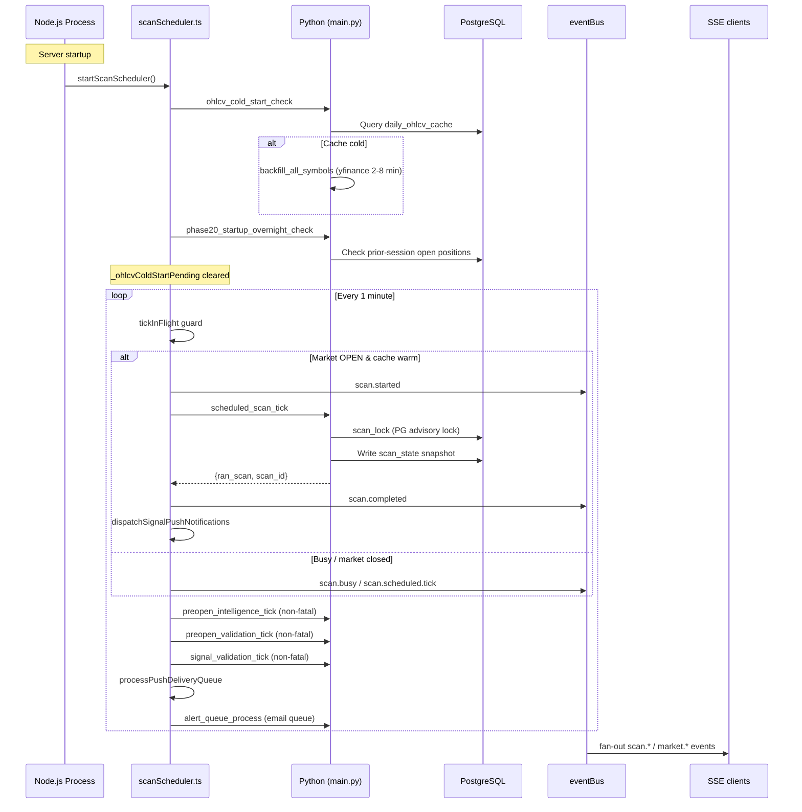

**Sources**:  
- `artifacts/api-server/src/lib/scanScheduler.ts` — `startScanScheduler()`, `_tick` closure  
- `artifacts/api-server/src/lib/events.ts` — `EventBus.publish()`  
- `artifacts/api-server/src/routes/stream.ts` — SSE endpoint, `refreshOnce()`

**Key behaviours**:
- `_ohlcvColdStartPending = true` at startup; set `false` in `.finally()` of `ohlcv_cold_start_check`. Pre-open ticks run even during backfill. (`scanScheduler.ts` L74, L334–337)
- A failed scan does **not** overwrite the last successful snapshot. (`scanScheduler.ts` comment L19)
- `tickInFlight` prevents stacking. (`scanScheduler.ts` L108)
- An immediate 15-second boot tick fires via `setTimeout(…, 15_000)`. (`scanScheduler.ts` L341)

---

## 4. Market Ingestion

### 4.1 OHLCV Data (Primary Path)

**Source**: `artifacts/api-server/src/python/ohlcv_cache_store.py`

| Layer | Detail |
|---|---|
| Primary store | `daily_ohlcv_cache` PostgreSQL table (symbol + trading_date PK) |
| Refresh state | `daily_ohlcv_refresh_state` (append-only run log) |
| Freshness tiers | LIVE ≤3 days, NEAR_LIVE ≤5 days, STALE ≤14 days, UNAVAILABLE >14 days |
| Min bars required | 120 bars (~6 months) |
| Feature flag | `OHLCV_CACHE_ENABLED` env var (default `true`) |
| Cold-start behaviour | `ohlcv_cold_start_check` in scheduler; triggers `backfill_all_symbols()` via yfinance if cache is cold (2–8 min); `_ohlcvColdStartPending` gate blocks scans during backfill |
| Warm-server path | Fast DB query (<1s); gate cleared before first 15-second tick fires |

### 4.2 Live Quotes (Index / LTP)

**Source**: `artifacts/api-server/src/routes/stream.ts` (`refreshOnce()`), `artifacts/api-server/src/python/market_data.py`

- Refresh loop: **30s** when market OPEN, **5 min** when closed. (`stream.ts` L56–57)
- Python `quotes` command calls `market_data.py:get_ltp()` which uses `yfinance.download()` with `period="5d"`, `interval="1d"`. **[UNVERIFIED-RUNTIME]**: Whether a live Kite WebSocket replaces this when `ZERODHA_*` is set — `kite.ts` routes exist for live Kite data (Phase 19) but the override path into `quotes` is not wired in the scan flow.
- `GET /api/market/quotes` and `GET /api/market/status` are served from the same refresh loop state.

### 4.3 Index / Regime Data

**Source**: `artifacts/api-server/src/python/market_regime.py`

- Symbols: `^NSEI` (NIFTY), `^NSEBANK` (BANKNIFTY), `^INDIAVIX`
- Fetched via `yfinance.download()` with `period="3mo"`, `interval="1d"` 
- Fallback (`_simulate_regime()`): returns `SIDEWAYS` with `adj_buy=10`, `adj_sell=10` when index fetch fails

### 4.4 Kite Connect Live Data (Phase 19, Conditional)

**Source**: `artifacts/api-server/src/routes/kite.ts`

- Routes: `GET /api/kite/status`, `GET /api/kite/login`, `GET /api/kite/callback`, plus quotes/holdings/positions/margins
- **Read-only**: "All order placement, modification, and cancellation endpoints are intentionally absent." (`kite.ts` L4–6)
- OAuth flow: `GET /api/kite/login` → Zerodha login page → callback URL → backend SHA-256 checksum → access token stored **backend only**
- Whether Kite live data feeds into the main scan pipeline or only into the Kite dashboard page is **[UNVERIFIED-RUNTIME]**

---

## 5. Pre-Open Intelligence

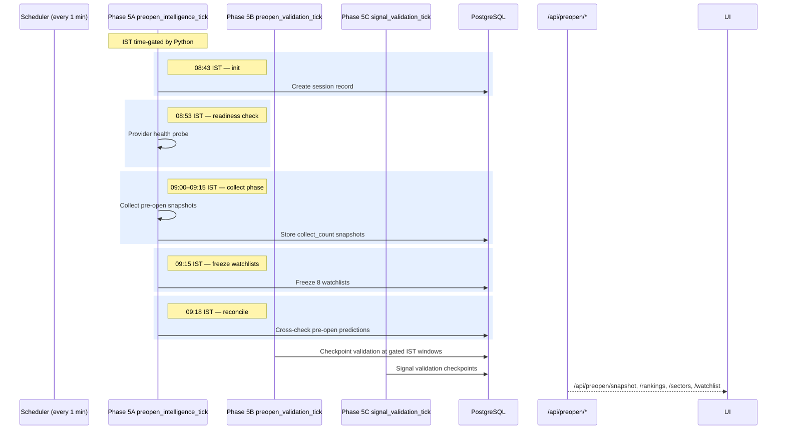

**Sources**:
- `artifacts/api-server/src/routes/preopen.ts` — route definitions + in-memory cache (TTLs: `status` 15s, `snapshot` 30s, `watchlist` 60s, `sectors` 30s)
- `artifacts/api-server/src/lib/scanScheduler.ts` L166–223 — tick calls

**Routes available**:
```
GET  /api/preopen/status          15s cache
GET  /api/preopen/health          30s cache
GET  /api/preopen/snapshot        30s cache
GET  /api/preopen/symbol/:symbol  –
GET  /api/preopen/rankings        30s cache
GET  /api/preopen/watchlist       60s cache (frozen 09:15 IST)
GET  /api/preopen/sectors         30s cache
GET  /api/preopen/report          60s cache
POST /api/preopen/refresh         busts cache
```

**Invariants**:
- All time-gating is **Python-side** (`preopen_intelligence_tick` command); the Node scheduler is a dumb every-minute trigger
- Pre-open data **cannot submit orders** (`preopen.ts` L23)
- Returns `{ status: "DISABLED" }` when `PREOPEN_INTELLIGENCE_ENABLED=false`

---

## 6. Universe Selection

### 6.1 Default Universe (Legacy / Primary)

**Source**: `artifacts/api-server/src/python/signal_engine.py`, `artifacts/api-server/src/routes/trading.ts`

- `GET /api/watchlist` → Python `watchlist` command → returns the operator-managed symbol list
- `GET /api/symbols` → Python `symbols` command → full approved NSE universe for autocomplete
- Watchlist is operator-editable via `POST /api/watchlist` / `DELETE /api/watchlist/:symbol`
- The scan pipeline (`phase7_scan`, `scan`, `scheduled_scan_tick`) scans the configured watchlist. Comments in `trading.ts` reference "50 symbols" (NIFTY 50), but the actual runtime universe depends on the `watchlist` DB contents **[UNVERIFIED-RUNTIME]**

### 6.2 Custom Universe (Phase 27 / Controlled)

**Source**: `artifacts/api-server/src/routes/universe-custom.ts`

- Separate custom-universe admin API; requires admin auth token
- Originally a 23-symbol low-price IT/Infra/Bank set (per project reports)
- Universe is switched into the scan pipeline via a setting in phase20_store **[UNVERIFIED-RUNTIME]**

⚠️ **DUAL-PATH**: The system has both a default NIFTY_50-style watchlist and a custom universe with separate admin routes. Which one drives a given scan depends on a Phase 20 setting whose runtime value is **[UNVERIFIED-RUNTIME]**.

---

## 7. Multi-Timeframe Scan Pipeline

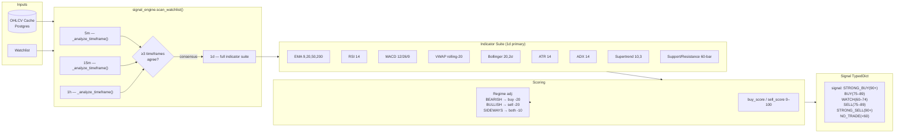

**Sources**:
- `artifacts/api-server/src/python/signal_engine.py` — full indicator library (L59–168), `_analyze_timeframe()` (L172–208), scoring (L196–679 [partially read])
- Signal thresholds in `config.py` (imported as `OPP_HOT_BUY_THRESHOLD`, `OPP_BUY_THRESHOLD`, etc.)

**Key rules** (`signal_engine.py` docstring):
- MTF requirement: signal generated **only when ≥3 timeframes agree** (`timeframe_alignment` field)  
- `HIGH_VOLATILITY` regime upgrades risk level  
- `_analyze_timeframe()` uses: EMA9 vs EMA20, MACD direction, RSI zone (3-point vote)

---

## 8. Signals / Strategy / Risk / Approval

### 8.1 Signal → AI Decision

**Source**: `artifacts/api-server/src/python/opportunity_scanner.py:rank_opportunities()` (fully read)

Opportunity score formula (0–100):
```
opp_score = trade_quality × 0.40
           + ai_confidence × 0.30
           + rr_score      × 0.20   (normalized: 4:1 R:R → 100)
           + mkt_alignment × 0.10
```

Status mapping:
- `HOT_BUY`: score ≥ 85
- `BUY`:     score ≥ 70
- `WATCH`:   score ≥ 50 (capped at 65)
- `IGNORE`:  score < 50

Inputs (1:1 aligned lists):
- `signals` ← `signal_engine.scan_watchlist()`
- `ai_decisions` ← `ai_decision.scan_ai_decisions()` [module exists; internals not read]
- `trade_qualities` ← `trade_quality.compute_trade_quality()`
- `position_sizes` ← `position_sizer.compute_from_signal()`
- `explainabilities` ← `explainability.explain_trade()`
- `market_context` ← `market_context.compute_market_context()`

### 8.2 Strategy Framework

**Source**: `artifacts/api-server/src/python/strategies.py`

Six built-in strategies (partial read):

| ID | Type | Entry |
|---|---|---|
| `trend_rider` | TREND | EMA stack + MACD + RSI + VWAP multi-confirmation |
| `breakout_hunter` | BREAKOUT | BB upper breakout + ADX + volume surge |
| `mean_reversion` | MEAN_REVERSION | RSI oversold + BB lower bounce |
| `ema_cross` | TREND | EMA9/EMA20 golden-cross |
| `macd_cross` | TREND | MACD line crosses above signal line |
| `supertrend_follow` | TREND | Supertrend direction flip to UP |

`StrategyBase` interface: `check_entry()`, `check_exit()`, `inspect_entry_rules()`, `compute_stop_loss()`, `compute_target()`.  
Default stop-loss: `entry - 2×ATR`. Default target: `entry + 2×risk` (2:1 R:R).

### 8.3 Risk Engine (Phase 20)

The risk engine (`risk_engine` Python command) enforces:
- Per-position capital cap: 20% of portfolio
- Per-sector exposure cap: 30% of portfolio  
- Max concurrent new positions: 5
- Daily loss limits and portfolio heat (specifics in `phase20_store.py` [not fully read])

**Sources**: Phase 20 references throughout `trading.ts`, `scanScheduler.ts`, `paper_trader.py`

### 8.4 Entry Approval Gate

**Source**: `artifacts/api-server/src/python/paper_entry_admission.py`, `artifacts/api-server/src/lib/controlledPaperEntryFlags.ts`

For **Controlled Paper Entry** (Phase 4A+):
- `CONTROLLED_PAPER_ENTRY_FRAMEWORK_ENABLED` (default: `false`)
- `CONTROLLED_PAPER_ENTRY_DRY_RUN_ONLY` (default: `true`)
- `CONTROLLED_PAPER_ENTRY_REQUIRE_OPERATOR_APPROVAL` (default: `true`)
- `executionAllowed` is **always `false`** in the flags type (hardcoded) — execution is never enabled through the flags object alone

DB-level serialization: `PAPER_ENTRY_ADMISSION_LOCK_ID = 2_026_081_900_001` (PostgreSQL advisory lock)

For **Advisory Bots** (Phase 2):
- Five flags: `ADVISORY_BOTS_ENABLED`, `…_API_ENABLED`, `…_UI_ENABLED`, `…_PERSIST_ENABLED`, `…_SCHEDULER_ENABLED`
- Persistence gated to `NODE_ENV=development` only (`advisoryFlags.ts` L31–38)

---

## 9. Paper Execution Lifecycle

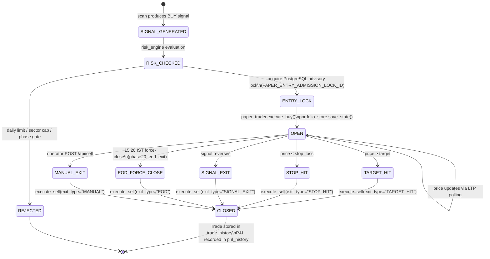

**Sources**:
- `artifacts/api-server/src/python/paper_trader.py` — `execute_buy()` (L192–), `execute_sell()` [partially read], `TradeReplayItem.exit_type` enum (L108)
- `INITIAL_CAPITAL = 100_000.0` as fallback; actual capital read from `phase20_store` (`paper_trader.py` L29)
- `SLIPPAGE_PCT = 0.05%` per side; `estimate_broker_charges()` includes STT 0.1%, exchange txn 0.00297%, SEBI 0.0001%, stamp duty 0.015% (buy only), GST 18% (`paper_trader.py` L35–47)
- State backed by PostgreSQL via `portfolio_store` module; fallback `state.json` for no-DB environments (`paper_trader.py` L136–141)

### 9.1 Buy Route (Manual / API)

```
POST /api/buy  →  trading.ts runPython(["buy", symbol, qty, price, reason])
              →  paper_trader.execute_buy()
              →  portfolio_store.save_state()
```

### 9.2 Automated Entry (Scheduled Scan)

```
scheduled_scan_tick (Python)
  → risk_engine approval
  → acquire PAPER_ENTRY_ADMISSION_LOCK_ID
  → paper_trader.execute_buy(bypass_risk=False, ledger_trade_id, scan_id)
  → portfolio_store.save_state()
```

---

## 10. Positions / Exits

### 10.1 Live Position Monitoring

- `GET /api/portfolio` → Python `portfolio` command → `paper_trader._compute_portfolio()` with LTPs
- LTPs fetched via `market_data.get_multiple_ltp()` (yfinance, sequential loop) **[UNVERIFIED-RUNTIME: whether batch or sequential]**
- Position stop-loss can be updated: `PATCH /api/portfolio/position/:symbol/stop` → `paper_trader.update_stop()`

### 10.2 Automated Exit Checks

Within `scheduled_scan_tick`:
1. For each open position: fetch current LTP
2. Check stop-loss breach → `execute_sell(exit_type="STOP_HIT")`
3. Check target reached → `execute_sell(exit_type="TARGET_HIT")`
4. Check signal reversal → `execute_sell(exit_type="SIGNAL_EXIT")`

Specific Python functions: **[UNKNOWN — `scheduled_scan_tick` internals not fully read]**

### 10.3 EOD Force-Close

- Command: `phase20_eod_exit` (invoked within `scheduled_scan_tick` or separately)
- Startup overnight-carry check: `phase20_startup_overnight_check` runs at server boot via `scanScheduler.ts` L256–280; if prior-session positions are found, EOD force-close is executed idempotently (guarded by `kv_claim_once("startup_overnight_check:<today>")`)

### 10.4 Manual Exit

```
POST /api/sell { symbol, quantity, price, reason }  →  paper_trader.execute_sell()
```

---

## 11. Portfolio / P&L / Risk

```mermaid
flowchart TD
    subgraph State["Portfolio State (portfolio_store.py)"]
        CASH[cash]
        POS[positions dict\nsymbol → qty, avg_price]
        TRADES[trade_history list]
        PNL_H[pnl_history list]
    end

    subgraph Compute["_compute_portfolio()"]
        LTP[fetch LTPs\nmarket_data.get_multiple_ltp]
        MKT[market_value = qty × ltp]
        GAIN[pnl = market_value − cost_basis]
        CAP[total_value = cash + invested]
        INIT[_store.get_initial_capital()]
        PCT[total_pnl_pct = total_pnl / initial_capital]
    end

    subgraph Caps["Portfolio-Level Risk Caps (Phase 20)"]
        C1[Per-position ≤ 20% portfolio]
        C2[Per-sector ≤ 30% portfolio]
        C3[Max 5 new positions]
        C4[Daily loss limit]
    end

    subgraph PM["Portfolio Manager"]
        RANK[rank full universe by risk-adj return]
        ALLOC[allocate capital under hard caps]
        BENCH[vs equal-weight benchmark]
    end

    State --> Compute
    Compute --> GET_PORT[GET /api/portfolio]
    Caps --> PE[paper_trader.execute_buy\nrisk check]
    PM --> GET_PM[GET /api/portfolio-manager\n10min cache]
```

**Sources**:
- `artifacts/api-server/src/python/paper_trader.py` — `_compute_portfolio()` (L150–187)
- `artifacts/api-server/src/routes/trading.ts` — `GET /api/portfolio-manager` (L2248–2270), cap comments (L2240–2243)

**Portfolio Reset**:
- `POST /api/portfolio/reset` requires body `{"confirmation": "RESET PORTFOLIO"}` — positions cleared, cash restored to initial capital; trade history **archived, never deleted** (`trading.ts` L243–263)

**Session Archives**:
- `GET /api/session-archives` / `GET /api/session-archives/:id`
- Restore: two-step flow — step 1 issues `restore_token`, step 2 requires phrase + token (`SESSION_RESTORE_CONFIRMATION = "RESTORE PAPER SESSION"`)

---

## 12. Alerts & System Health

### 12.1 Push Notifications

**Source**: `artifacts/api-server/src/lib/pushNotifier.ts`

- Provider: **Expo Push API** (`https://exp.host/--/api/v2/push/send`)
- Trigger: after each successful scan via `dispatchSignalPushNotifications()`
- Logic: for each enabled subscription, compares `last_notified_key` to `signals_cache.updated_at`; if new, filters actionable BUY/SELL ≥ subscriber's `min_confidence`; sends one summary push
- Invalid tokens (`DeviceNotRegistered`) are deleted from `push_subscriptions` table
- Purely advisory — push notifications never trigger trading actions

### 12.2 Email Alert Queue

**Source**: `artifacts/api-server/src/lib/alertQueue.ts` [not read, inferred from `scanScheduler.ts` L231]

- Command `alert_queue_process` runs every scheduler tick — durable queue with retry across restarts

### 12.3 System Health Endpoints

```
GET  /api/health                        → health.ts
GET  /api/live-data/health              → phase7_health command
GET  /api/live-data/health-v2           → live_health_v2 command
GET  /api/readiness                     → readiness.ts
GET  /api/kite/status                   → kite_status command (Kite session)
GET  /api/live-data/scan/status         → scan_state metadata (15s cache, no-store)
GET  /api/live-data/coverage            → scanner_coverage (30s cache)
```

### 12.4 Reconciliation (Broker / Paper)

**Two distinct reconciliation flows coexist** — ⚠️ **DUAL-PATH**:

**Flow A — API Server (paper reconciliation)**:
- `GET /api/broker/reconciliation` → `reconcil_status` Python command
- `POST /api/broker/reconciliation/trigger` → `reconcil_trigger` (up to 120s timeout)
- `POST /api/broker/reconciliation/resolve` → mark discrepancy resolved

**Flow B — Intraday Bot (live broker reconciliation)**:
- `intraday-trading-bot/src/brokers/zerodha/reconciliation.py` → `ReconciliationEngine`
- 9 discrepancy types: `LOCAL_ONLY`, `BROKER_ONLY`, `STATE_MISMATCH`, `FILL_MISMATCH`, `QUANTITY_MISMATCH`, `PRICE_MISMATCH`, `MISSING_EXCHANGE_ORDER_ID`, `DUPLICATE_ORDER`, `UNRESOLVED_BROKER_EVENT`
- Triggers: startup, WebSocket reconnect, uncertain order, failed cancel/modify, periodic
- Results published to API server via: `POST /api/broker/reconciliation/publish` (requires `RECON_PUBLISH_TOKEN` header)

**Source**: `artifacts/api-server/src/routes/reconciliation.ts`, `intraday-trading-bot/src/brokers/zerodha/reconciliation.py`

### 12.5 Kill Switch (Intraday Bot)

**Source**: `intraday-trading-bot/src/core/kill_switch.py`

Four levels:
1. `NORMAL` — orders allowed
2. `PAUSE` — no new orders, can modify existing
3. `CANCEL_PENDING` — cancel all pending orders
4. `FLATTEN_ALL` — cancel pending + flatten all positions

`KillSwitchManager.escalate()` only allows upward escalation; reset is a separate explicit action.

---

## 13. Replay & Research

```mermaid
flowchart TD
    subgraph Replay["Market Replay (trading.ts GET /api/market-replay)"]
        MR_IN[scan_date + holding_period + interval]
        MR_CACHE[10-min per-params cache]
        MR_PY[market_replay.py\nhistorical scan + forward simulation]
        MR_OUT[scan results + projected outcomes]
    end

    subgraph TradeReplay["Trade Replay (paper_trader.py)"]
        TR[GET /api/trade-replay → trade_replay command]
        TR_DATA[TradeReplayItem list\nentry/exit + AI metadata\nstrategy_id, outcome_classification]
    end

    subgraph HKB["Historical Knowledge Base (Sprint 3)"]
        HK_BUILD[POST /api/historical-knowledge/build\nyears=1|3|5 — detached process]
        HK_STATUS[GET /api/historical-knowledge/summary → status file polling]
        HK_TRADES[GET /api/historical-knowledge/trades → DB query]
        HK_DB[(historical_knowledge\nDB table)]
    end

    subgraph WF["Walk-Forward Validation (v2.4)"]
        WF_RUN[POST /api/walk-forward/run — detached process]
        WF_STATUS[GET /api/walk-forward/status\npid liveness check]
        WF_RESULT[GET /api/walk-forward/result]
        WF_EXPORT[GET /api/walk-forward/export/:kind\nreport|trades|windows|calibration|costs|evidence_report CSV]
    end

    subgraph Experiments["Experiment Manager (Phase 4)"]
        EXP_SUBMIT[POST /api/experiments]
        EXP_RUN[POST /api/experiments/:id/run — detached]
        EXP_STATUS[GET /api/experiments/:id — status.json + PID liveness]
        EXP_REPORT[GET /api/experiments/:id/report]
        BATCH[GET /api/batches — grouped by batch_id]
    end

    MR_IN --> MR_CACHE --> MR_PY --> MR_OUT
    TR --> TR_DATA
    HK_BUILD --> HK_DB --> HK_TRADES
    WF_RUN --> WF_STATUS --> WF_RESULT --> WF_EXPORT
    EXP_SUBMIT --> EXP_RUN --> EXP_STATUS --> EXP_REPORT
```

**Sources**:
- `artifacts/api-server/src/routes/trading.ts` — all routes above (L381–2115)
- `artifacts/api-server/src/python/market_replay.py` — [not fully read]
- `artifacts/api-server/src/python/paper_trader.py` — `TradeReplayItem` TypedDict (L92–116)

**Key details**:
- Long-running processes (`historical_knowledge_build`, `walk_forward_run`, `experiment_run`) spawn **detached** Python processes; Node writes a placeholder `status.json` immediately so UI sees "running" before Python boots
- PID liveness check prevents stale "running" labels after crashes (`wfStatusFileRunning()`, `expRunning()`)
- OOM kills captured in `runner.log` and written to `status.json` with crash details
- Market Replay cache: 10 min per `(scan_date, holding_period, interval)` key
- `GET /api/market-replay` requires `scan_date` in `YYYY-MM-DD` format; invalid format → HTTP 400

---

## 14. Analytics & AI

### 14.1 Core Analytics Endpoints (trading.ts)

| Endpoint | Cache | Python Command | Description |
|---|---|---|---|
| `GET /api/trade-decisions` | 10 min | `trade_decisions` | Full decision pipeline per stock |
| `GET /api/portfolio-manager` | 10 min | `portfolio_manager` | Portfolio-level allocation decisions |
| `GET /api/evidence-research` | 10 min | `evidence_research` | Similarity to historical KB trades (0–100) |
| `GET /api/feature-importance` | 10 min | `feature_importance` | Rolling indicator importance from KB |
| `GET /api/opportunity-scan` | idempotent | `opportunity_scan` | `rank_opportunities()` output |
| `GET /api/market-scan` | 2 min | `market_scan` | Full universe scan (legacy path) |
| `GET /api/ai-decisions` | – | `ai_decisions` | Per-stock AI decision batch |
| `GET /api/learning-summary` | – | `learning_summary` | Adaptive learning state |
| `GET /api/trade-intelligence` | – | `trade_intelligence N` | Historical completed trades with indicators |
| `GET /api/predictive-intelligence/:symbol` | – | `predictive_intelligence` | Evidence for one candidate setup |
| `GET /api/learning-insights` | – | `learning_insights` | Sprint 3 Module 3 aggregations |
| `GET /api/pattern-quality` | – | `pattern_quality` | Strategy × sector × regime expectancy |

### 14.2 AI Decision Pipeline

**Source**: `artifacts/api-server/src/python/opportunity_scanner.py` (inputs docstring L122–134)

Input modules (sourced from `opportunity_scanner.py` L110–134 and Python module list):
- `signal_engine.scan_watchlist()` → raw technical signals
- `ai_decision.scan_ai_decisions()` → AI confidence + decision override [module not fully read]
- `trade_quality.compute_trade_quality()` → 6-component quality score (trend/momentum/volume/breakout/risk/market)
- `position_sizer.compute_from_signal()` → suggested qty, capital %, feasibility
- `explainability.explain_trade()` → approve/avoid reasons, one-liner, summary
- `market_context.compute_market_context()` → score, bias, sector strength, breadth

### 14.3 Meta-Learning & Evolution (Phase 6.5 / Phase 6)

```
GET  /api/meta-learning/health|failures|eligibility|improvements|contradictions
GET  /api/meta-learning/compare?a=<id>&b=<id>
POST /api/meta-learning/create-mutation   — creates DRAFT only, never activates
GET  /api/evolution/registry|tree|leaderboard|knowledge|ab-tests
POST /api/evolution/mutate                — creates Draft variants, never activates
POST /api/evolution/status                — explicit human lifecycle action
POST /api/evolution/ab-test
POST /api/evolution/evaluate              — survival rules check
```

All evolution and meta-learning mutations are **advisory / research only** — nothing auto-activates.

### 14.4 AI Forecast (Intraday Bot)

**Source**: `intraday-trading-bot/src/ai_forecast/`

- `kronos_adapter.py` — Kronos time-series forecasting adapter [external model; **[UNKNOWN]** if Kronos is deployed]
- `confidence_gate.py` — gates trades by AI forecast confidence threshold
- `features.py` — feature engineering for AI models
- `volatility.py` — volatility-adjusted confidence
- `benchmark.py` — benchmark comparison

This AI layer is part of the **intraday-trading-bot** codebase, not the API server. Whether its outputs feed the main scan pipeline is **[UNVERIFIED-RUNTIME]**.

---

## 15. Dashboard Refresh (Frontend-to-Backend)

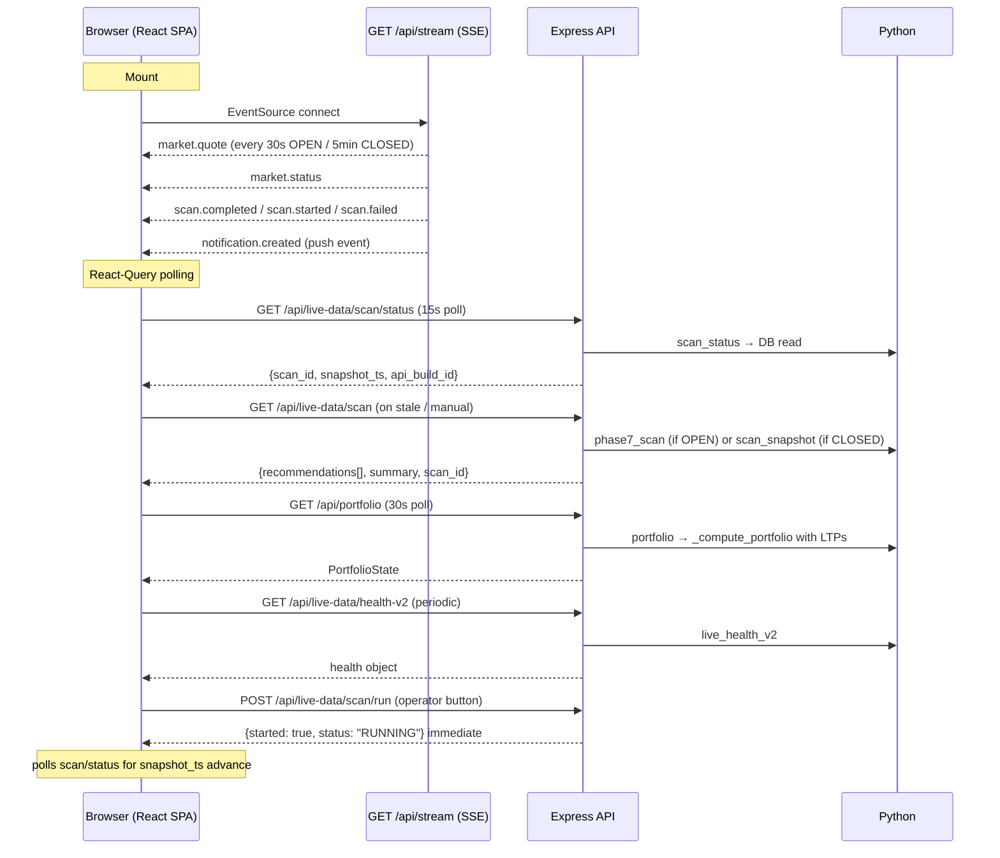

**Sources**:
- `artifacts/trading-dashboard/src/hooks/useLiveStream.ts` — SSE subscriber, `MAX_RETRY_MS = 30_000`
- `artifacts/api-server/src/routes/stream.ts` — SSE endpoint, `OPEN_INTERVAL_MS = 30s`, `CLOSED_INTERVAL_MS = 5min`
- `artifacts/api-server/src/routes/trading.ts` — `POST /api/live-data/scan/run` fire-and-forget (L1464–1537)

**Caching overview**:

| Route | TTL | Notes |
|---|---|---|
| `/api/live-data/scan/status` | 15s in-process | `no-store` header; generation counter invalidation |
| `/api/live-data/scan` (p7Cache) | 10 min | Cleared on manual scan trigger |
| `/api/live-data/coverage` | 30s | |
| `/api/market-scan` | 2 min | Shareable in-flight |
| `/api/trade-decisions` | 10 min | |
| `/api/portfolio-manager` | 10 min | |
| `/api/evidence-research` | 10 min | |
| `/api/market-replay` | 10 min per key | |
| Stream refresh | 30s (open) / 5 min (closed) | |

**Manual scan flow** (`POST /api/live-data/scan/run`):
1. Check market OPEN; reject with 409 if CLOSED
2. Rate-limit: 30s gap between manual triggers; reject with 429 if too soon
3. If `p7InFlight` exists → return `{started: true, status: "ALREADY_RUNNING"}`
4. Otherwise: clear p7Cache + marketScanCache, publish `scan.started`, fire `getP7Scan(true)` in background, return `{started: true, status: "RUNNING"}` immediately
5. On completion: publish `scan.completed`, `invalidateScanCaches()`, dispatch push notifications

**Scan abort** (`POST /api/live-data/scan/abort`): sends `SIGTERM` to the Python child process and rejects the in-flight promise. Identity checks prevent clobbering a subsequent scan.

---

## 16. External Systems

### 16.1 Yahoo Finance (yfinance)

- **Used by**: `market_data.py`, `market_regime.py`, `ohlcv_cache_store.py`
- **Purpose**: OHLCV data (`.NS` suffix for NSE symbols), index data (no suffix)
- **Timeout exposure**: full 50-symbol scan takes 90–150s; scan commands get 150s timeout (`trading.ts` L38–41)
- **Fallback**: OHLCV cache serves warm data; regime falls back to simulated neutral

### 16.2 Zerodha Kite Connect

- **Used by**: `artifacts/api-server/src/routes/kite.ts` (Phase 19), `intraday-trading-bot/src/brokers/zerodha/`
- **API Server role**: Read-only (quotes, holdings, positions, margins, orders, instruments); OAuth session management
- **Bot role**: Full order gateway with 5 safety gates, idempotency, reconciliation, WebSocket real-time data
- **Activation gate** (bot): All 5 env vars required: `ZERODHA_ENABLED`, `ZERODHA_PAPER_TRADING=false`, `ZERODHA_LIVE_TRADING_ENABLED`, `ZERODHA_API_KEY`, `ZERODHA_ACCESS_TOKEN`
- **Token expiry**: `intraday-trading-bot/src/brokers/zerodha/expiry_monitor.py` — monitors token expiry, triggers reconnect

### 16.3 Expo Push Notification Service

- **Endpoint**: `https://exp.host/--/api/v2/push/send`
- **Used by**: `artifacts/api-server/src/lib/pushNotifier.ts`
- **Token format**: `ExponentPushToken[…]` or `ExpoPushToken[…]`
- **Failure handling**: `DeviceNotRegistered` → delete token from DB; other errors logged but non-fatal

### 16.4 PostgreSQL

- **Used by**: Both codebases extensively
- **API Server key tables**: `daily_ohlcv_cache`, `daily_ohlcv_refresh_state`, `push_subscriptions`, `signals_cache`, `scan_state` (implied), advisory lock `2_026_081_900_001`, phase20 settings/state
- **Bot key tables**: `broker_order_correlations`, `broker_reconciliation_runs`, `broker_reconciliation_discrepancies`, `positions`, `orders`, `fills`, `risk_state`, `sessions`, `strategy_signal`, `strategy_state`, `ledger`, `announcements`, `heartbeats`, `incidents`
- **Connection**: `DATABASE_URL` env var; API server uses Drizzle ORM (`@workspace/db`); bot uses SQLAlchemy async

### 16.5 Replit Platform

- `REPLIT_DEPLOYMENT` / `REPLIT_DEPLOYMENT_ID` used as fallback for `APEXQUANT_BUILD_ID` (`trading.ts` L29–34)
- `RECON_PUBLISH_TOKEN` shared between bot and API server for reconciliation publishing
- `KITE_CALLBACK_URL` constructed from `x-forwarded-proto` / `x-forwarded-host` headers

---

## 17. Diagram: Pre-Open Session

```mermaid
gantt
    title Pre-Open Intelligence Session (IST)
    dateFormat HH:mm
    axisFormat %H:%M

    section Phase 5A (preopen_intelligence_tick)
    Init               :milestone, 08:43, 0min
    Readiness probe    :milestone, 08:53, 0min
    Collect phase      :active, 09:00, 15min
    Freeze watchlists  :milestone, 09:15, 0min
    Reconcile          :milestone, 09:18, 0min

    section Phase 5B (preopen_validation_tick)
    Checkpoint windows :crit, 08:43, 35min

    section Phase 5C (signal_validation_tick)
    Signal checkpoints :crit, 08:43, 35min

    section Market Opens
    Regular session    :09:15, 6h15min
```

---

## 18. Diagram: Trading Session

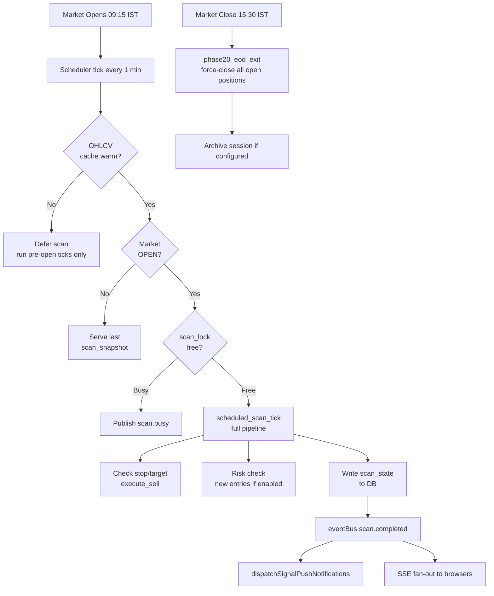

---

## 19. Diagram: Paper-Order Lifecycle

```mermaid
stateDiagram-v2
    direction LR
    [*] --> Scanning: scan pipeline runs
    Scanning --> RiskCheck: signal ≥ BUY threshold
    RiskCheck --> Rejected: cap breach / flag off
    RiskCheck --> AdvisoryLock: acquire PG advisory lock
    AdvisoryLock --> OPEN: execute_buy()\nsave_state()
    OPEN --> Monitoring: LTP poll each scan tick
    Monitoring --> OPEN: price between SL and target
    Monitoring --> Closing: SL/target/reversal/EOD/manual
    Closing --> ClosedTrade: execute_sell()\npnl_history updated
    ClosedTrade --> TradeReplayDB: stored as TradeReplayItem\n(AI metadata attached)
    TradeReplayDB --> [*]
    Rejected --> [*]
```

---

## 20. Diagram: Portfolio / Risk Loop

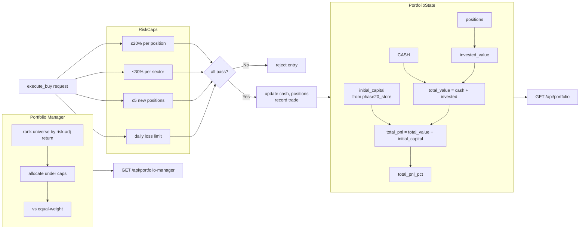

---

## 21. Diagram: Replay & Research

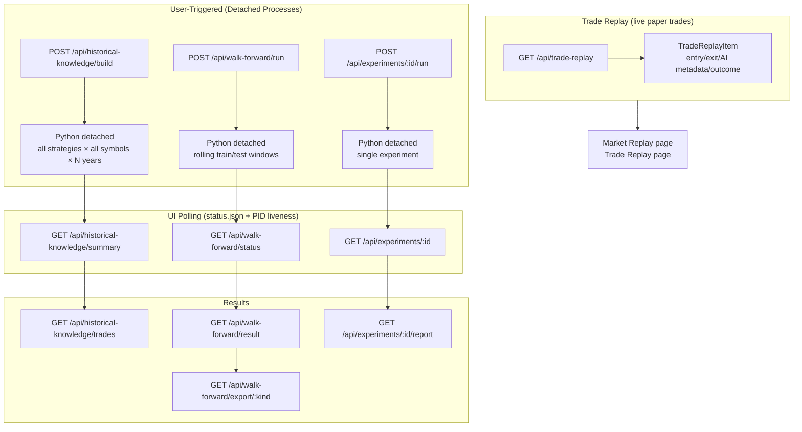

---

## Appendix A: Legacy vs Canonical Scan Flows

⚠️ **DUAL-PATH** — Two scan paths coexist in `artifacts/api-server/src/routes/trading.ts`:

| Aspect | Legacy (`/run-scan` / `scan`) | Canonical (`/live-data/scan` / `phase7_scan`) |
|---|---|---|
| Route | `POST /api/run-scan` | `GET /api/live-data/scan`, `POST /api/live-data/scan/run` |
| Python command | `scan` | `phase7_scan` |
| Process tracking | `rsScanProc` / `rsScanReject` / `rsScanInFlight` | `p7Proc` / `p7InFlightReject` / `p7InFlight` |
| Cache | None (route-level) | `p7Cache` (10 min) |
| Market-closed guard | None on GET | Returns last `scan_snapshot` from DB |
| Rate limit | None | 30s gap |
| Abort support | `POST /api/live-data/scan/abort` kills both | Same |
| Phase 7 annotation | No `rr_gap` | Annotates `rr_gap` per recommendation |
| Dashboard | `useRunScan()` hook (legacy) | `useLiveStream` scan events + polling |
| Status | Not tracked | `GET /api/live-data/scan/status` |

Comments in `trading.ts` L990–991: "All Phase 7 routes serve the SAME canonical scan result (via cache). No real broker APIs are called. No real orders are placed."

The `POST /api/run-scan` path and `scan` Python command appear to be a **legacy intelligence scan** path still used by `useRunScan()` hook. Whether this runs a separate Python function or delegates to the same `phase7_scan` logic is **[UNVERIFIED-RUNTIME]**.

---

## Appendix B: Phase Flag System

| Flag Group | Flags | Default | Effect |
|---|---|---|---|
| Controlled Paper Entry | `CONTROLLED_PAPER_ENTRY_FRAMEWORK_ENABLED` | `false` | Enables framework |
| | `CONTROLLED_PAPER_ENTRY_DRY_RUN_ONLY` | `true` | Blocks real execution |
| | `CONTROLLED_PAPER_ENTRY_REQUIRE_OPERATOR_APPROVAL` | `true` | Gates entries |
| | `CONTROLLED_PAPER_ENTRY_ALLOW_AUTO_ENABLE` | `false` | |
| | `CONTROLLED_PAPER_ENTRY_ALLOW_BOOTSTRAP` | `false` | |
| Advisory Bots | `ADVISORY_BOTS_ENABLED` | (unset = false) | Enables advisory bots |
| | `ADVISORY_BOTS_PERSIST_ENABLED` | (unset = false) | Persistence only in dev/test |
| OHLCV Cache | `OHLCV_CACHE_ENABLED` | `true` | Disables yfinance caching |
| Scan Scheduler | `DISABLE_SCAN_SCHEDULER` | (unset) | Disables all auto-scans |
| Pre-Open Intelligence | `PREOPEN_INTELLIGENCE_ENABLED` | (unset = active) | Returns DISABLED |
| Signal Validation | `SIGNAL_VALIDATION_ENABLED` | (unset = active) | Returns DISABLED |
| Zerodha Live Mode | 5 gates (see §16.2) | all off | Enables live orders in bot |

---

## Appendix C: Key Python Command→Function Map

| Python `main.py` command | Module/Function |
|---|---|
| `portfolio` | `paper_trader._compute_portfolio()` |
| `signals` | `signal_engine.scan_watchlist()` |
| `scan` / `phase7_scan` | Full scan pipeline (details **[UNVERIFIED-RUNTIME]**) |
| `scheduled_scan_tick` | Phase 20 scheduled scan coordinator |
| `opportunity_scan` | `opportunity_scanner.rank_opportunities()` |
| `market_context` | `market_context.compute_market_context()` |
| `market_regime` | `market_regime.get_regime()` |
| `ai_decisions` | `ai_decision.scan_ai_decisions()` |
| `trade_replay` | `paper_trader.get_trade_replay()` **[UNVERIFIED]** |
| `ohlcv_cold_start_check` | `ohlcv_cache_store` cold-start logic |
| `preopen_intelligence_tick` | Phase 5A module |
| `preopen_validation_tick` | Phase 5B module |
| `signal_validation_tick` | Phase 5C module |
| `alert_queue_process` | email alert queue drain |
| `phase20_startup_overnight_check` | overnight-carry force-close |
| `phase20_eod_exit` | EOD position force-close |
| `scan_status` | `scan_state` DB read + metadata |
| `scan_snapshot` | last durable scan from DB |
| `scanner_coverage` | coverage verdict for dashboard banner |
| `reconcil_status` | broker reconciliation summary |
| `reconcil_trigger` | trigger reconciliation run |
| `trade_decisions` | full decision pipeline per stock |
| `portfolio_manager` | portfolio-level allocation |
| `evidence_research` | historical KB similarity |
| `feature_importance` | indicator importance |
| `walk_forward_run` | detached WF validator |
| `experiment_run` | detached experiment runner |
| `historical_knowledge_build` | detached KB builder |
| `market_replay` | historical replay simulation |
| `kite_status` | Kite Connect session health |

---

*Document generated by source analysis only. Runtime behaviour of all **[UNVERIFIED-RUNTIME]** items requires live execution tracing.*
