# INTRADAY MASTER ARCHITECTURE

## Project Identity

| Field | Value |
|---|---|
| **Project Name** | NSE Intraday Paper-Trading Platform (ApexQuant) |
| **Repository Root** | `/` (workspace root) |
| **Branch** | `phase4a-controlled-paper-entry-framework-disabled` |
| **Commit** | `891288296f70ec52a917b46b0d906d4230153464` |
| **Audit Date** | 2026-08-23 (Asia/Kolkata) |
| **Auditor** | Static source inspection (no runtime access) |

---

## Artifact Inventory

| Artifact | Kind | Path | Preview |
|---|---|---|---|
| API Server | api | `artifacts/api-server` | `/api` |
| NSE Trading Dashboard | web | `artifacts/trading-dashboard` | `/trading-dashboard/` |
| NSE Trading Mobile | mobile | `artifacts/trading-mobile` | `/trading-mobile/` |
| Intraday Trade Hub | web | `artifacts/trading-document-hub` | `/trading-document-hub/` |
| NSE Trading Platform Video | video | `artifacts/project-video` | `/project-video/` |
| Canvas | design | `artifacts/mockup-sandbox` | `/__mockup` |

---

## Derived Counts (Source-Verified)

| Metric | Count | Source |
|---|---|---|
| **Web dashboard routes** (App.tsx `<Route path=...>`) | 118 static + 1 conditional (`/advisory` guarded by `isAdvisoryUiEnabled()`) = **119 total** | `artifacts/trading-dashboard/src/App.tsx` |
| **Mobile tab screens** | **7** (index/Dashboard, health/Health, signals/Signals, watchlist/Watchlist, positions/Positions, alerts/Alerts, ai-ops/Pipeline) | `artifacts/trading-mobile/app/(tabs)/` |
| **API router method declarations** (non-test route files) | **770** | `artifacts/api-server/src/routes/*.ts` (excluding *.test.ts files) |
| **API route files** (non-test) | **70** | `artifacts/api-server/src/routes/` |
| **Unique code-defined SQLite/Postgres table names** | **77** (excluding runtime-named `{TABLE}` placeholders) | `artifacts/api-server/src/python/*.py` (non-test) |
| **Page/field lineage rows** (one primary row for every route/tab plus source-proven subview rows) | **166** | `INTRADAY_PAGE_DATA_LINEAGE.csv` |
| **Explicit displayed-field lineage rows** (excluding page-summary and `UNKNOWN` rows) | **164** | `INTRADAY_PAGE_DATA_LINEAGE.csv`, `Displayed field` column |
| **API inventory rows** (one row per concrete router declaration) | **770** | `INTRADAY_API_MAP.csv` |
| **Data quality findings** | **39** | `INTRADAY_DATA_QUALITY_AUDIT.md` |

**⚠️ Database Runtime-Verification Caveat:** The 77 table count is code-defined (from `CREATE TABLE IF NOT EXISTS` statements). No database connection was made. Actual tables present in any live PostgreSQL or SQLite database cannot be confirmed from static analysis alone. PostgreSQL tables exist only when `DATABASE_URL` is set and the relevant Python module has executed its schema initialisation at least once.

---

## Reference Documents

| Document | Description |
|---|---|
| `INTRADAY_PAGE_DATA_LINEAGE.csv` | Complete inventory of all 119 web routes + 7 mobile tab screens: component, title, purpose, navigation, hooks, refresh interval, data classification |
| `INTRADAY_API_MAP.csv` | All 770 concrete router method declarations: endpoint, HTTP method, route file, handler line, Python handler / dependency, frontend state key |
| `INTRADAY_DATABASE_MAP.md` | Code-defined Postgres + SQLite table inventory with source file references, key columns, and runtime-verification caveat |
| `INTRADAY_BUSINESS_LOGIC_MAP.md` | End-to-end business logic for all 16 domains: ingestion, pre-open, universe, MTF, signals, risk, paper execution, positions, exits, P&L, alerts, replay, analytics, refresh, scheduler, external systems |
| `INTRADAY_DATA_QUALITY_AUDIT.md` | 39 source-evidenced findings across 9 categories: seeded/demo, hardcoded, stale, duplicated, unclear/dead, legacy paths, impossible-value, refresh, and error handling |

---

## High-Level Technology Stack

| Layer | Technology |
|---|---|
| API Server | Node.js + Express (TypeScript), port 5000 |
| Business Logic | Python 3 (subprocess via `spawn`), 744 non-test modules |
| Databases | PostgreSQL (`DATABASE_URL`) + SQLite (`trade_intelligence.db`) |
| Frontend (Web) | React 18 + Vite + TypeScript, wouter router, TanStack Query |
| Frontend (Mobile) | React Native + Expo Router, Expo tabs |
| Broker Integration | Zerodha Kite Connect API (OAuth2) |
| Market Data Fallback | yfinance (Python) |
| Push Notifications | Expo Push Notification Service |
| Real-Time Transport | Server-Sent Events (SSE) `/stream` endpoint |
| Agent Framework | 12-agent pipeline (supervisor, market_data, research, market_intelligence, monitoring, strategy, risk, ai_decision, execution, learning, knowledge, operations) |

---

## Mermaid Architecture Diagrams

### Diagram A — High-Level System Overview

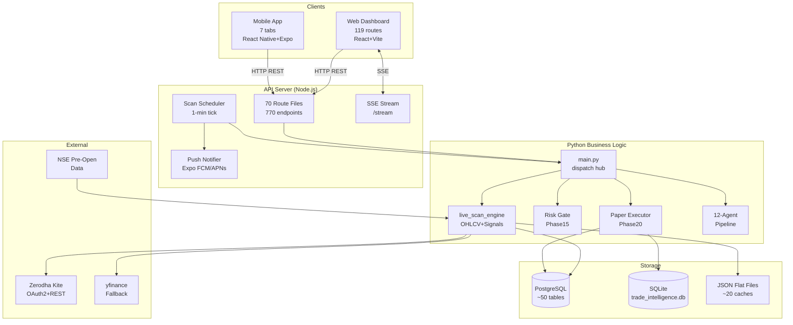

### Diagram B — End-to-End Trade Flow

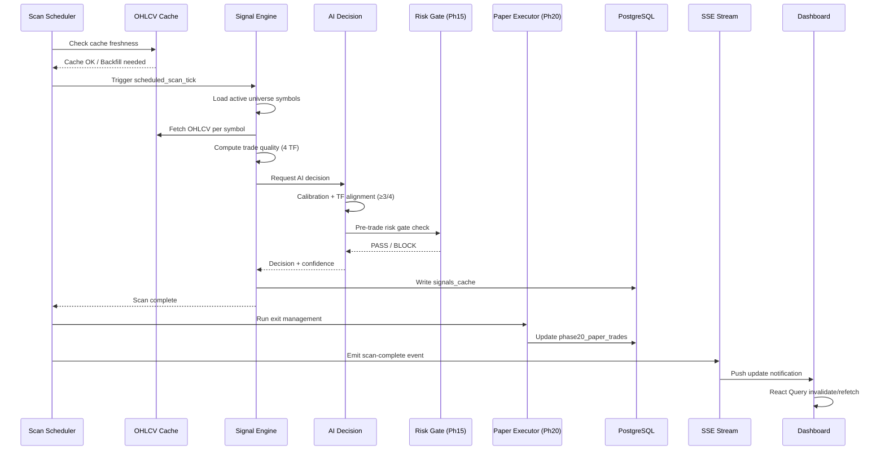

### Diagram C — Frontend / Backend Route Mapping

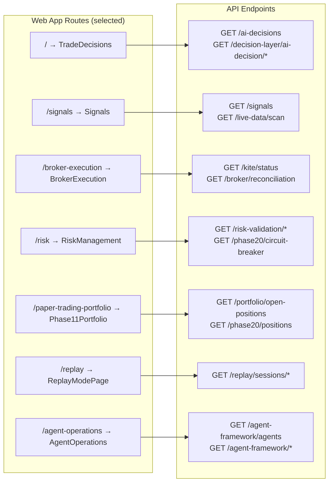

### Diagram D — Database Architecture

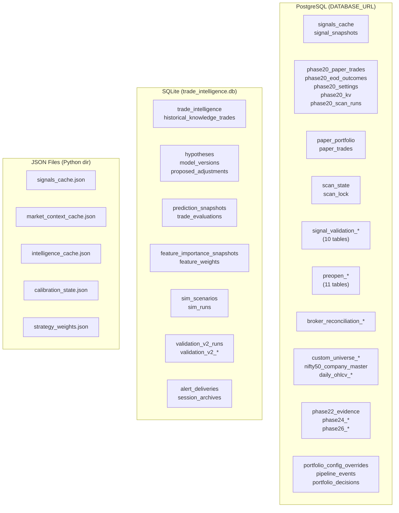

### Diagram E — Scheduler & Event Flow

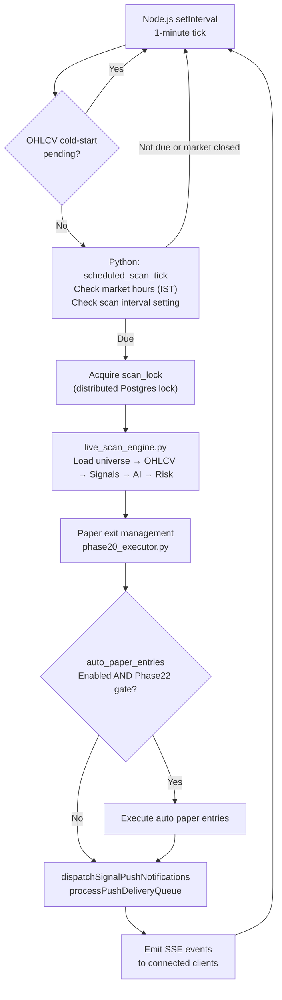

### Diagram F — Pre-Open Intelligence Flow

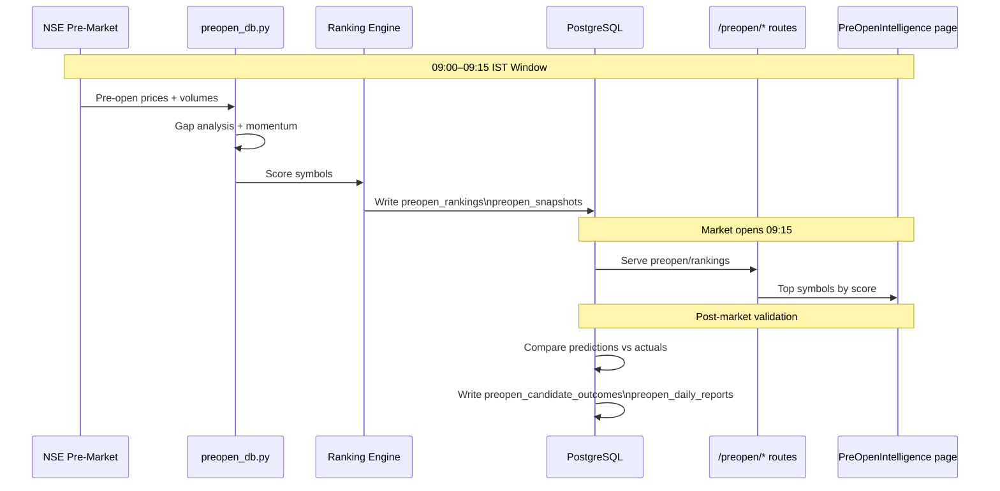

### Diagram G — Trading Session Flow

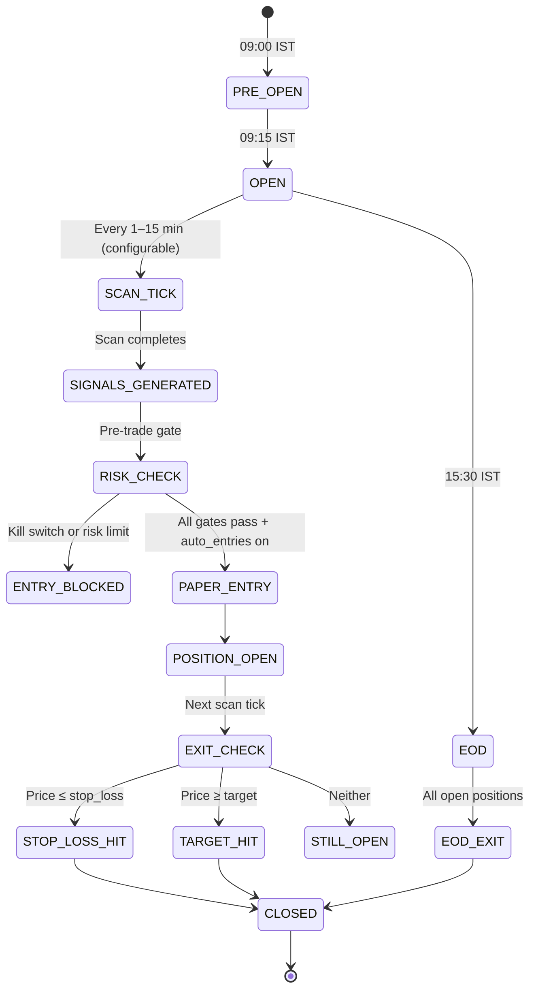

### Diagram H — Order / Paper Trade Lifecycle

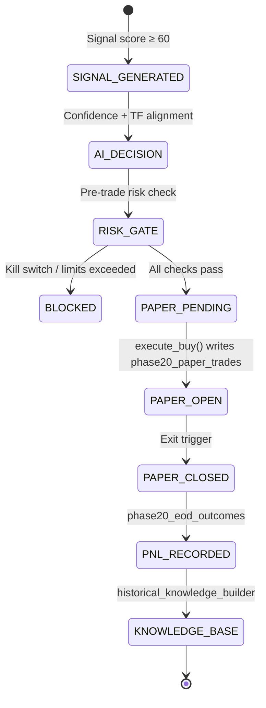

### Diagram I — Portfolio & Risk Flow

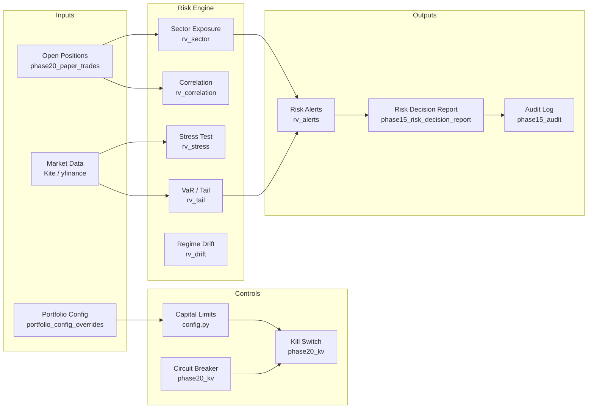

### Diagram J — Replay & Research Flow

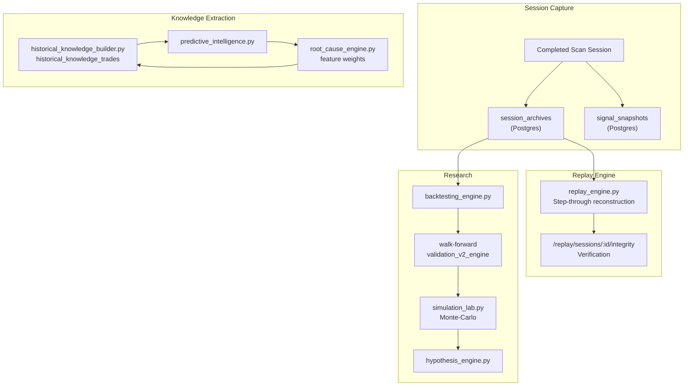

### Diagram K — Navigation (Web & Mobile)

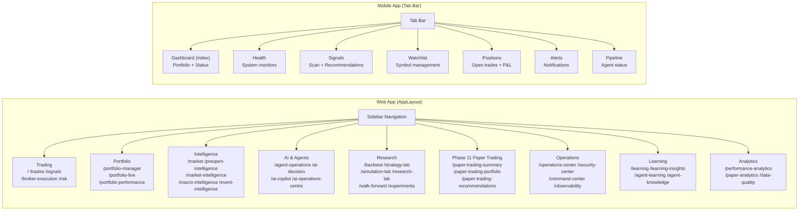

### Diagram L — Cross-Page Data Dependencies

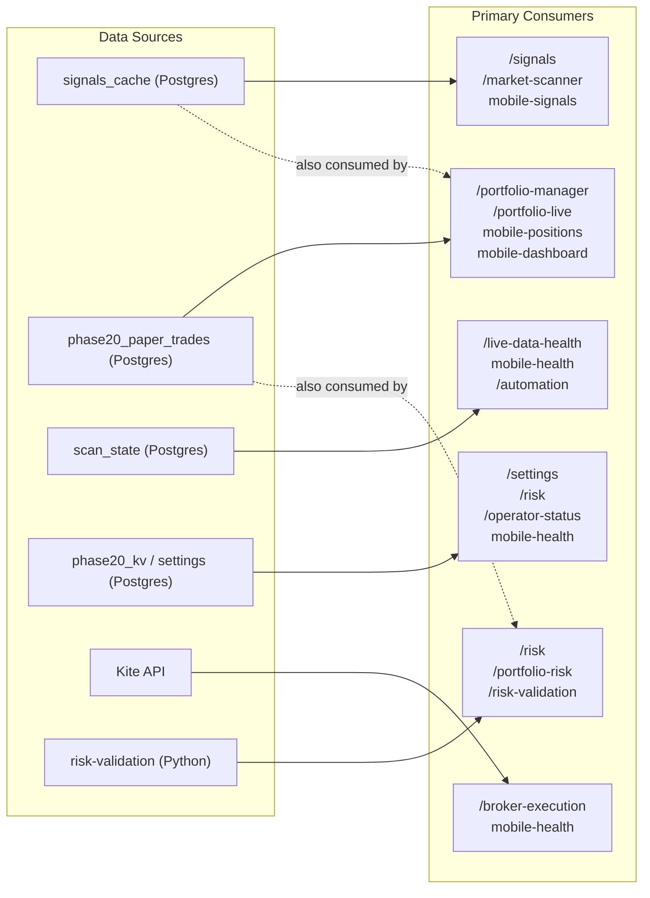

---

## Audit Methodology & UNKNOWN Boundaries

### Methodology
1. **Route enumeration:** `App.tsx` parsed for all `<Route path=...>` declarations (deterministic grep).
2. **Mobile tabs:** `(tabs)/` directory listed; `_layout.tsx` inspected for tab names and screen components.
3. **API count:** `grep -cE 'router\.(get|post|put|patch|delete)\('` run across all non-test `.ts` files in routes/; sum verified as 770.
4. **Database tables:** `grep -rn "CREATE TABLE IF NOT EXISTS"` across non-test Python files; unique names deduplicated.
5. **Business logic:** Source files traced via route handlers → Python dispatch → module imports.
6. **Data quality:** Pattern search for seeding, hardcoded constants, stale-data patterns, error handling.

### UNKNOWN Boundaries
- **Runtime state:** No database was queried; no live API calls were made.
- **`collaborationEngine.ts` and `autonomousOps.ts`:** Zero router declarations found; internal logic UNKNOWN.
- **`trading.db`:** SQLite file exists but source origin UNKNOWN (no matching CREATE TABLE in source).
- **Custom universe table name:** Runtime-configured via f-string; static analysis cannot resolve.
- **Phase 16 / 17 / 18 UI consumers:** Routes registered but no corresponding App.tsx page imports found.
- **Exact content of `validation_runs/wf_result.json` and experiment JSON files:** Not read; may contain stale data.
- **Stuck scan-lock TTL:** Exact value in `scan_state_store.py` not fully read.
- **Advisory UI flag value:** `isAdvisoryUiEnabled()` is a runtime function; whether `/advisory` route is active in production is UNKNOWN.
