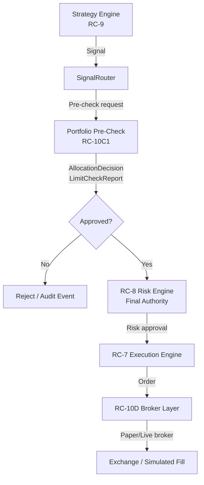
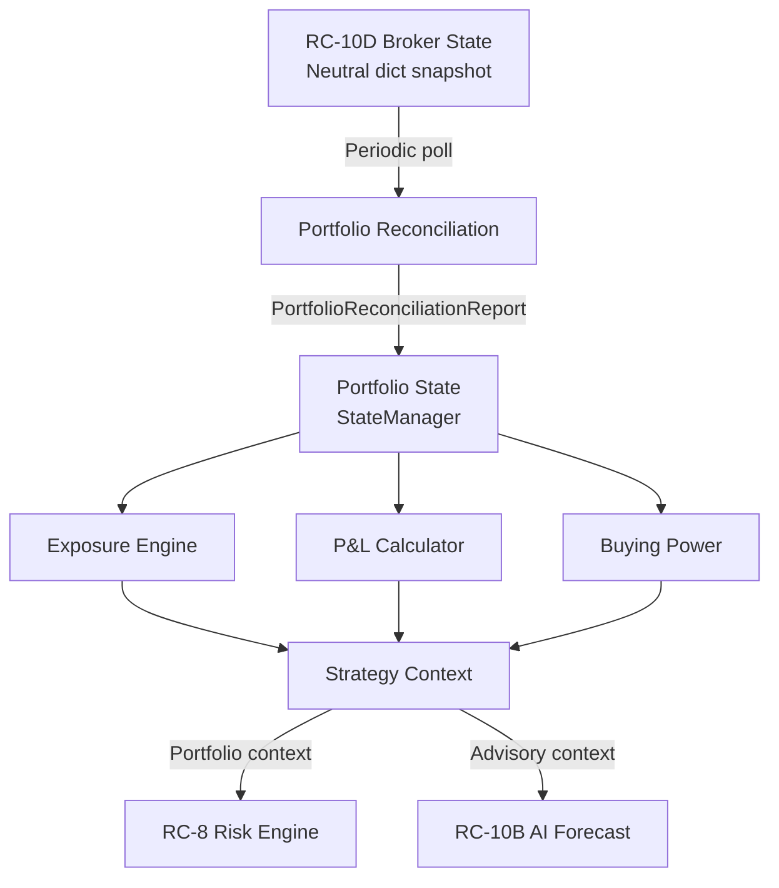
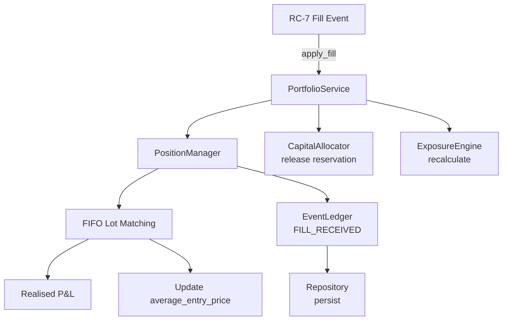

# RC-10C1 Portfolio Architecture

**Document status:** Baseline  
**Phase:** RC-10C1 Portfolio Core  
**Module root:** `src/portfolio/`

---

## 1. System Flow Diagram

### 1.1 Primary Signal-to-Execution Flow



### 1.2 Feedback Flow (Broker State → Portfolio)



### 1.3 Fill Processing Flow



---

## 2. Module Layer Descriptions

### Layer 0: Contracts (`contracts.py`)

Frozen, validated Pydantic models that define the entire domain vocabulary. All inter-module communication uses these types. No module may use raw dicts for portfolio domain data.

Key contracts:
- `PortfolioSnapshot` — complete authoritative state at a point in time
- `PortfolioPosition` / `PortfolioLot` — mutable position tracking with immutable lot records
- `AllocationDecision` — output of capital allocator with TTL
- `PositionSizeDecision` — output of position sizer
- `ExposureSnapshot` — aggregate exposure across all dimensions
- `PortfolioPnL` / `PositionPnL` — P&L with fee decomposition
- `PortfolioEvent` — immutable ledger entry with idempotency key
- `PortfolioReconciliationReport` / `PortfolioDiscrepancy` — reconciliation results
- `PortfolioHealth` — live readiness and health status
- `LimitCheckResult` / `LimitCheckReport` — structured limit evaluation output

### Layer 1: Configuration (`config.py`)

`PortfolioConfig` is frozen on construction. All limits, thresholds, and intervals are validated at startup. `paper_mode=True` is enforced by model validator — no runtime override permitted.

Environment variable prefix: `PORTFOLIO_*`

### Layer 2: Exceptions (`exceptions.py`)

Typed domain exceptions forming a hierarchy under `PortfolioError`. Each exception maps to a specific failure mode with a clear recovery path. No exception triggers a broker call.

| Exception | Trigger |
|-----------|---------|
| `PortfolioNotReadyError` | State not yet recovered or reconciled |
| `InsufficientCapitalError` | Buying power exhausted |
| `ExposureLimitBreachedError` | Instrument/sector/strategy cap exceeded |
| `PortfolioLimitBreachedError` | Open positions, gross exposure, etc. |
| `DuplicateEventError` | Idempotency key already applied |
| `StalePortfolioStateError` | State timestamp exceeds stale threshold |
| `ReconciliationRequiredError` | Critical broker discrepancy detected |
| `CorruptSnapshotError` | Checksum mismatch on loaded snapshot |
| `InvalidPositionTransitionError` | Illegal position state machine transition |
| `ReservedCapitalViolationError` | Would breach cash_reserve_pct |
| `StaleAllocationError` | AllocationDecision past expires_at |
| `PortfolioVersionConflictError` | Optimistic concurrency check failed |
| `NegativeQuantityError` | Quantity rounds to zero or below |
| `PortfolioHaltedError` | Kill-switch or critical limit breach active |

### Layer 3: State (`state.py`)

`StateManager` — single authoritative in-memory portfolio state. Protected by `asyncio.Lock`. Exposes deterministic update methods; all mutations enter through defined commands or events. Rejects illegal state transitions. Maintains version counter incremented on every mutation.

Tracks: available cash, blocked cash, used/available margin, buying power, all positions (open + closed today), pending orders, all P&L dimensions, all exposure dimensions, peak equity, drawdown, state timestamp.

### Layer 4: Ledger (`ledger.py`)

Append-only event ledger. Assigns monotonic sequence numbers. Enforces idempotency keys — duplicate events raise `DuplicateEventError` and are treated as no-ops by the caller. Events are immutable after recording. Supports deterministic replay ordering by sequence number.

### Layer 5: Position Manager (`position_manager.py`)

Implements the full position lifecycle state machine. Uses FIFO lot matching for realised P&L. Handles partial fills, duplicate fill events (idempotent), and out-of-order fills safely. Prevents negative quantities on long positions. Side reversal requires explicit close-then-open.

### Layer 6: P&L Calculator (`pnl.py`)

Deterministic P&L accounting with strict separation of estimated vs confirmed charges. Calculates: realised P&L, unrealised P&L, gross/net P&L, all NSE fee components, daily P&L, drawdown. Rolls daily P&L at IST midnight.

### Layer 7: Capital Allocator (`capital_allocator.py`)

Evaluates capital requests against portfolio state. Produces `AllocationDecision` with TTL (`expires_at`). Enforces cash reserve. Stale decisions are rejected at commit time. Deterministic and broker-call-free.

### Layer 8: Position Sizer (`position_sizer.py`)

Advisory service producing `PositionSizeDecision`. Uses Decimal arithmetic throughout. Rounds down to lot size boundaries. Never rounds up beyond exposure or risk limits. Zero-quantity results in rejection. AI confidence scaling is optional and configurable.

### Layer 9: Exposure Engine (`exposure.py`)

Calculates all exposure dimensions from current positions plus pending orders. Produces `ExposureSnapshot`. Flags stale market prices. Avoids double-counting partially filled orders. Outputs both absolute values and portfolio percentages.

### Layer 10: Limits (`limits.py`)

Evaluates all configured portfolio limits for a proposed action. Returns `LimitCheckReport` with per-limit `LimitCheckResult` entries. Critical breaches may request the existing RC-8 kill-switch but do not implement a competing switch. All breaches are auditable via ledger events.

### Layer 11: Health (`health.py`)

Produces `PortfolioHealth` from current state. Aggregates: initialisation status, recovery status, reconciliation status, freshness metrics, unresolved discrepancies, critical breach count. Controls the `readiness` gate that blocks new order approvals.

### Layer 12: Reconciliation (`reconciliation.py`)

Compares local portfolio state against RC-10D broker-neutral snapshot. Classifies and persists discrepancies. Supports dry-run mode. Critical discrepancies set `portfolio_ready=False`. No blind destructive corrections — all applied corrections are audited.

### Layer 13: Service (`service.py`)

`PortfolioService` — the public facade. All external callers use this interface exclusively. Coordinates all layers. Injected via dependency injection; strategies and AI modules never access sub-layers directly.

### Layer 14: Repositories (`repositories/`)

Async persistence layer using `asyncio.to_thread` for database I/O. Five repository classes covering snapshots, events, allocations, exposure snapshots, and reconciliation records.

---

## 3. Full Module Structure

```
src/portfolio/
├── __init__.py
├── config.py                   # PortfolioConfig (frozen)
├── contracts.py                # All domain models (frozen)
├── exceptions.py               # Typed exception hierarchy
├── state.py                    # StateManager (asyncio.Lock)
├── ledger.py                   # Append-only event ledger
├── position_manager.py         # Position lifecycle + FIFO lots
├── capital_allocator.py        # AllocationDecision production
├── position_sizer.py           # PositionSizeDecision production
├── exposure.py                 # ExposureSnapshot calculation
├── pnl.py                      # P&L + fee accounting
├── limits.py                   # LimitCheckReport evaluation
├── health.py                   # PortfolioHealth aggregation
├── reconciliation.py           # Broker-state comparison
├── service.py                  # PortfolioService facade
└── repositories/
    ├── __init__.py
    ├── portfolio_snapshot.py   # PortfolioSnapshot persistence
    ├── portfolio_event.py      # PortfolioEvent persistence
    ├── capital_allocation.py   # AllocationDecision persistence
    ├── exposure_snapshot.py    # ExposureSnapshot persistence
    └── reconciliation.py      # Reconciliation reports + discrepancies
```

---

## 4. Concurrency Model

### 4.1 StateManager Lock

`StateManager` holds a single `asyncio.Lock` protecting all mutable portfolio state. Rules:

- Lock is acquired before reading or writing position data, cash balances, or margin state
- Lock is released as quickly as possible — no awaiting external I/O while holding the lock
- Read-only queries (e.g., `get_snapshot`) acquire the lock briefly to produce a consistent snapshot, then release
- Event application acquires the lock for the duration of the state mutation only

### 4.2 Repository Threading

Database I/O uses `asyncio.to_thread` to prevent blocking the event loop. Repositories are the only components permitted to perform synchronous I/O; all other layers are pure in-memory.

### 4.3 Optimistic Version Checks

Allocation decisions carry a `portfolio_state_version`. At commit time, the current state version is compared against the version recorded at decision time. If they differ, `PortfolioVersionConflictError` is raised and the decision is re-evaluated.

### 4.4 Idempotency Enforcement

Every `PortfolioEvent` carries a unique `idempotency_key`. The ledger checks this key before applying any event. Duplicate events raise `DuplicateEventError`; callers treat this as a no-op (not a failure).

---

## 5. Key Design Decisions

| Decision | Rationale |
|----------|-----------|
| Single `asyncio.Lock` in StateManager | Simplest correct concurrency model for single-process; avoids deadlock complexity |
| Immutable contracts (frozen Pydantic) | Prevents accidental mutation across layers; enables safe sharing |
| Mutable `PortfolioPosition` | Incremental updates are performance-critical; immutability would require full object replacement on every tick |
| FIFO lot matching | Exchange standard for tax and audit compliance; deterministic and unambiguous |
| Decimal throughout | INR financial calculations require exact arithmetic; float is prohibited |
| Optional PortfolioService injection | Preserves backward compatibility; system operates without portfolio module if not configured |
| Dry-run reconciliation default | Prevents accidental state corruption; all corrections require explicit non-dry-run call |
| AllocationDecision TTL | Prevents stale approvals from being committed after market conditions change |
| paper_mode enforced at config level | Live trading cannot be accidentally enabled; requires code-level change, not config change |
| Separate estimated vs confirmed fees | Broker confirms charges post-trade; estimated values are flagged to prevent P&L overconfidence |
