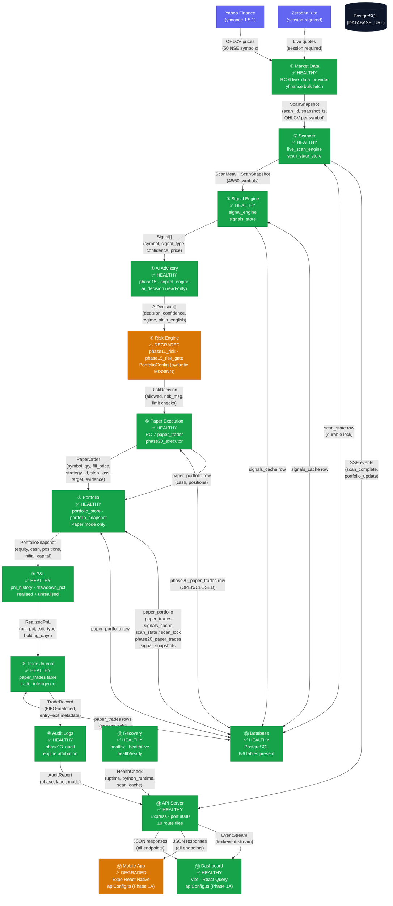

# Phase 2A — ApexQuant AI System Dependency Graph

## Overview

This Mermaid flowchart shows the complete data flow from market ingestion through
portfolio output and audit. Each node is one of the 15 audited subsystems; each
edge is labelled with the data object that crosses it.

## Full Data-Flow Graph

## Simplified Critical Path

The minimal path from market data to a completed paper trade:

```mermaid
flowchart LR
    A["Yahoo Finance\n(yfinance)"] -->|OHLCV| B["Market Data\n①"]
    B -->|ScanSnapshot| C["Scanner\n②"]
    C -->|Signal| D["Signal Engine\n③"]
    D -->|AIDecision| E["AI Advisory\n④"]
    E -->|RiskDecision| F["Risk Engine\n⑤"]
    F -->|PaperOrder| G["Paper Execution\n⑥"]
    G -->|Position| H["Portfolio\n⑦"]
    H -->|PnL| I["P&L\n⑧"]
    I -->|TradeRecord| J["Trade Journal\n⑨"]
    J -->|AuditEntry| K["Audit Logs\n⑩"]
```

## Data Objects Glossary

| Object | Producer | Consumer | Description |
|--------|----------|----------|-------------|
| `ScanSnapshot` | Market Data | Scanner | Full OHLCV + indicators per symbol, stamped with `scan_id` and `snapshot_ts` |
| `ScanMeta` | Scanner | Signal Engine / DB | Lightweight: scan_id, status, coverage, missing symbols |
| `Signal[]` | Signal Engine | AI Advisory | `{symbol, signal_type, confidence, price, reasons[]}` — pure observation, no execution advice |
| `AIDecision[]` | AI Advisory | Risk Engine | `{stock, decision, confidence, regime, target, stop_loss, rr_ratio, plain_english}` — advisory_only always true |
| `RiskDecision` | Risk Engine | Paper Execution | `{allowed: bool, risk_msg}` — enforces position limits, daily loss, sector exposure |
| `PaperOrder` | Paper Execution | Portfolio | `{trade_id, symbol, qty, fill_price, stop_loss, target, evidence, status: OPEN}` |
| `PortfolioSnapshot` | Portfolio | P&L / API | `{equity, cash, open_positions[], realised_pnl_today, unrealised_pnl, drawdown_pct}` |
| `RealizedPnL` | P&L | Trade Journal | `{pnl, pnl_pct, exit_type, holding_days}` stamped at SELL |
| `TradeRecord` | Trade Journal | Audit Logs | Full FIFO-matched round-trip with entry + exit metadata |
| `AuditReport` | Audit Logs | API | Phase 13 engine attribution, PAPER label, mode |
| `HealthCheck` | Recovery | API | `{status, uptime_s, python_runtime, scan_cache}` |
| `SSEEvent` | Scanner / Portfolio | Dashboard | `{type: scan_complete\|portfolio_update, payload}` |

## Subsystem Status Summary

| # | Subsystem | Status | Key Module(s) |
|---|-----------|--------|---------------|
| 1 | Market Data | ✅ HEALTHY | `live_data_provider.py`, `market_data.py`, yfinance |
| 2 | Scanner | ✅ HEALTHY | `live_scan_engine.py`, `scan_state_store.py` |
| 3 | Signal Engine | ✅ HEALTHY | `signal_engine.py`, `signals_store.py` |
| 4 | AI Advisory | ✅ HEALTHY | `phase15_*.py`, `copilot_engine.py`, `ai_decision.py` |
| 5 | Risk Engine | ⚠️ DEGRADED | `phase11_risk.py`, `phase15_risk_gate.py`, `PortfolioConfig` |
| 6 | Paper Execution | ✅ HEALTHY | `paper_trader.py`, `phase20_executor.py` |
| 7 | Portfolio | ✅ HEALTHY | `portfolio_store.py`, `portfolio_snapshot.py` |
| 8 | P&L | ✅ HEALTHY | `portfolio_snapshot.py` (drawdown, pnl fields) |
| 9 | Trade Journal | ✅ HEALTHY | `paper_trades` table, `trade_intelligence.py` |
| 10 | Audit Logs | ✅ HEALTHY | `phase13_audit.py` |
| 11 | Recovery | ✅ HEALTHY | `health.ts` (healthz, health/live, health/ready) |
| 12 | Mobile App | ⚠️ DEGRADED | Expo workflow (port conflict), `lib/apiConfig.ts` |
| 13 | Dashboard | ✅ HEALTHY | Vite dev server, `src/lib/apiConfig.ts` |
| 14 | API Server | ✅ HEALTHY | `app.ts`, 10 route files, port 8080 |
| 15 | Database | ✅ HEALTHY | PostgreSQL, psycopg2, 6/6 tables present |
